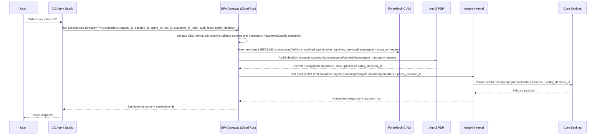
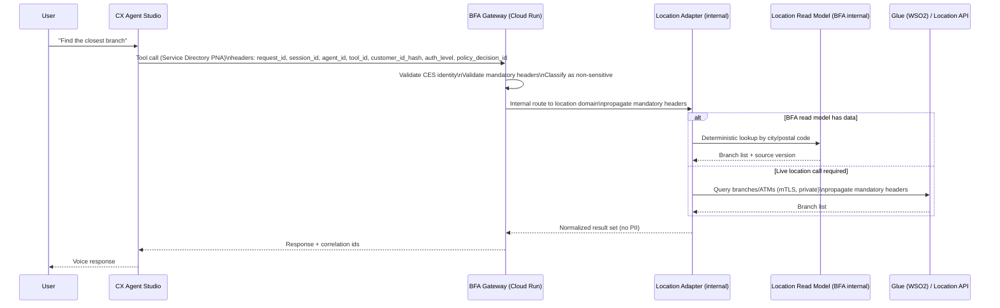
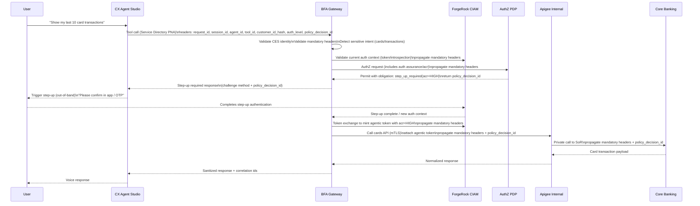
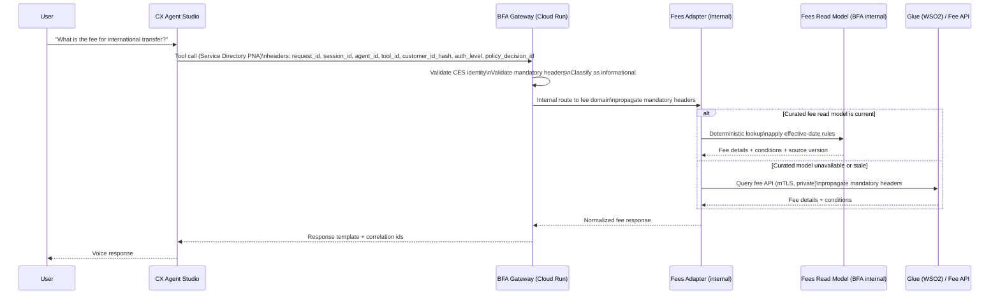
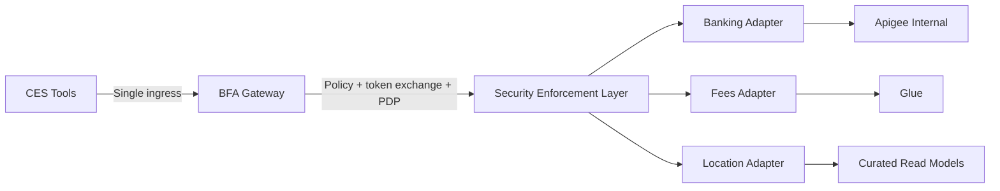
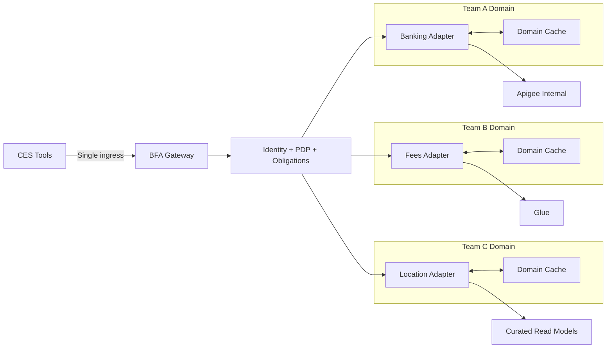
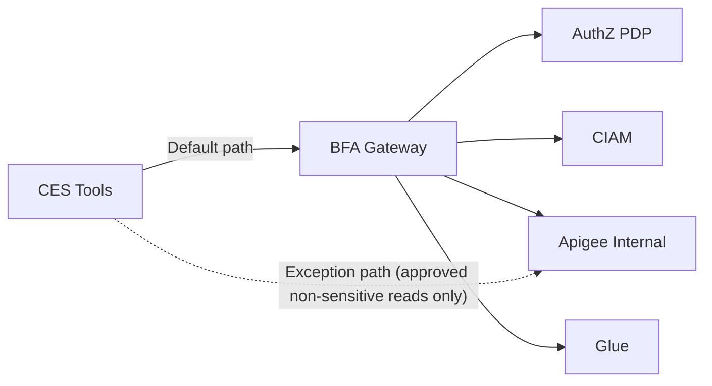

# Acme Banking — Mermaid Diagrams

> These diagrams are provided as individual `.mmd` files and also embedded here for quick viewing.
> Canonical agent names/IDs/source mapping: `../agent-registry.md`
> Updated by Codex on 2026-02-28 for P0 architecture alignment.

## Context diagram
```mermaid
flowchart LR
  subgraph User[End User]
    U((Voice Caller))
  end

  subgraph GoogleManaged[Google-managed: CX Agent Studio]
    CES[CX Agent Studio\nRoot + Subagents]
  end

  subgraph Perimeter[VPC-SC Service Perimeter: acme-landingzone]
    subgraph NetProj[Net Project / Shared VPC]
      SD[Service Directory\nPrivate Network Access]
      ILB[Internal HTTP(S) LB]
      DNS[Cloud DNS Private Zones]
      IC[Cloud Interconnect\n(HA VLAN attachments)]
    end

    subgraph AppProj[App Project]
      BFA[BFA Gateway\nCloud Run (internal)]
      AUTHZ[AuthZ PDP Service\n(Cloud Run or GKE)]
      OBS[Logs/Traces/Audit Sinks]
      KB[Knowledge Index]
      FEES[Fees Read Model]
    end

    subgraph ApigeeProj[Apigee Project]
      AP[Apigee Internal\n(GCP-based)]
    end
  end

  subgraph CIAMLandingZone[GCP Landing Zone: CIAM]
    CIAM[ForgeRock CIAM]
  end

  subgraph OnPrem[On-Prem DC]
    GLUE[Glue (WSO2 API Manager)]
    CORE[Core Systems of Record]
  end

  U --> CES
  CES -->|Tool call via SD PNA| SD
  SD --> ILB --> BFA

  BFA --> AUTHZ
  BFA -->|Token exchange / introspection| CIAM
  BFA -->|Regulated/productized APIs| AP
  BFA -->|Legacy/internal APIs| GLUE

  AP -->|via Interconnect| IC --> CORE
  GLUE -->|via Interconnect| IC --> CORE
  %% NOTE: CIAM is GCP cloud-hosted — no Interconnect dependency

  BFA --> OBS
  BFA --> KB
  BFA --> FEES
  DNS --- SD
```

## Sequence: Balance inquiry (sensitive)


## Sequence: Branch lookup (non-sensitive)


## Sequence: Step-up authentication (ACR-driven)


## Sequence: Fee lookup (deterministic)


## ADR-0104 review: Connectivity (unverified state)
```mermaid
flowchart LR
  subgraph User[End User]
    U((Voice Caller))
  end

  subgraph GoogleManaged[Google-managed]
    CES[CX Agent Studio]
  end

  subgraph GCP[GCP Landing Zone]
    SD[Service Directory PNA]
    ILB[Internal HTTP(S) Load Balancer]
    BFA[BFA Gateway]
    ADP[Domain Adapters]
    PDP[AuthZ PDP]
  end

  subgraph CIAMLandingZone2[GCP Landing Zone: CIAM]
    CIAM[ForgeRock CIAM]
  end

  subgraph OnPrem[On-Premises]
    GLUE[Glue WSO2 API Manager]
  end

  subgraph ApigeeProj[Apigee Project]
    AP[Apigee Internal]
  end

  subgraph Hybrid[Hybrid Network Controls]
    IC[Cloud Interconnect]
    VPN[Cloud VPN Fallback]
    DNS[Private DNS Split-Horizon]
    FW[Firewall + Routing Policy]
    MTLS[mTLS Trust Chain]
  end

  U --> CES
  CES --> SD --> ILB --> BFA --> ADP
  BFA --> PDP
  ADP --> AP
  ADP -.->|UNVERIFIED| GLUE
  BFA -.->|UNVERIFIED| CIAM
  ADP -.->|depends on| IC
  ADP -.->|fallback| VPN
  ADP -.->|depends on| DNS
  ADP -.->|depends on| FW
  ADP -.->|depends on| MTLS
```

## ADR-0104 review: Option A (strict single BFA)


## ADR-0104 review: Option B (federated adapters)


## ADR-0104 review: Option C (controlled Apigee exceptions)

