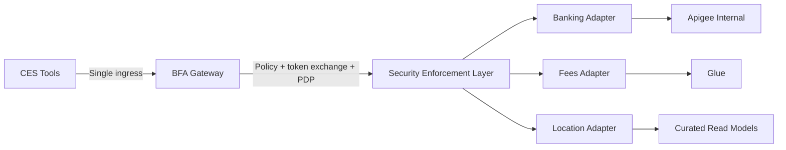

# ADR-0104 Option A: Strict Single BFA Gateway

**Status:** Design option deep dive  
**Date:** 2026-02-28  
**Created by:** Codex on 2026-02-28

---

## 1) Option summary

Keep a strict single ingress model:
- CES tools call only BFA gateway.
- BFA is the mandatory policy enforcement boundary (identity validation, token exchange, PDP enforcement, redaction, correlation).
- Internal adapters are domain-owned, but not directly reachable from CES.
- Apigee and Glue calls happen only from behind BFA.

Diagram:
- `architecture/diagrams/adr-0104-option-a-strict-single-bfa.mmd`

---

## 2) Security view

Strengths:
- Best alignment with ADR-0108 (service identity first, backend secret custody).
- Cleanest enforcement path for ADR-0107 layered PEP strategy.
- Easiest way to enforce uniform PII minimization and DLP at one boundary.

Risks:
- Central gateway policy mistakes can affect all domains.

Controls:
- Deny-by-default routing.
- Shared redaction library and correlation-header conformance tests.
- Fail-closed behavior on token/PDP/mTLS failures.

---

## 3) Network feasibility view

Pros:
- CES is isolated from Glue connectivity complexity.
- Only BFA runtime requires hybrid network paths to on-prem.

Risk:
- If BFA->Glue connectivity remains unverified, Glue-backed domains remain blocked.

Mitigation:
- Enforce readiness gates from ADR-0101/0102 before Glue-dependent production paths.

---

## 4) Latency and SLA view

Pros:
- Predictable external path (`CES -> BFA`).
- Centralized tuning for min instances, connection pooling, and adaptive timeouts.

Trade-off:
- Additional hop can increase tail latency if caching is not domain-aware.

Guidance:
- Use curated read models for informational domains.
- For balances, avoid stale-cache by default; evaluate hot preload only with explicit consistency rules.

---

## 5) Governance view

Pros:
- Strongest audit traceability and policy consistency.
- Simplest external attack surface.

Trade-off:
- Requires strong platform governance and release discipline around gateway interfaces.

---

## 6) Developer experience view

Pros:
- Teams can still own internal adapters and release independently behind stable contracts.

Trade-off:
- Teams depend on shared gateway/platform backlog for cross-cutting changes.

---

## 7) Best-fit conditions

Option A is best when:
1. Security and governance consistency outweigh direct path performance gains.
2. Token/secret handling must remain centralized.
3. Team maturity for shared platform contracts is acceptable.

---

## 8) Open decisions to close

1. Glue connectivity readiness timeline.
2. Gateway vs adapter cache ownership split.
3. Shared ownership model for BFA platform and adapter conformance suites.

---

## 9) Changelog

| Date | Author | Change |
|---|---|---|
| 2026-02-28 | Codex | Initial Option A deep dive |
