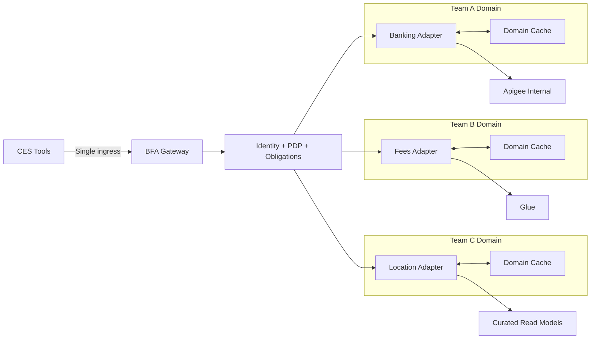

# ADR-0104 Option B: Single Ingress with Federated Internal Domain Adapters

**Status:** Design option deep dive  
**Date:** 2026-02-28  
**Created by:** Codex on 2026-02-28

---

## 1) Option summary

Retain single external ingress while federating internal delivery:
- CES still calls only BFA.
- BFA keeps identity/token/PDP/obligation enforcement.
- Domain teams own adapters end-to-end internally (routing logic, schema normalization, domain cache policy).
- Domain adapters can optimize for Apigee, Glue, or curated read models without exposing CES to upstream complexity.

Diagram:
- `architecture/diagrams/adr-0104-option-b-federated-adapters.mmd`

---

## 2) Security view

Strengths:
- Preserves ADR-0108 by keeping token/secrets out of CES tool configs.
- Preserves ADR-0107 if BFA remains primary PEP and policy obligations are non-bypassable.

Risks:
- Internal policy drift if adapters implement inconsistent redaction/obligation behavior.

Controls:
- Mandatory adapter conformance contract.
- Shared security middleware package across Java/Python/Node.js adapters.
- CI gates for correlation headers and fail-closed behavior.

---

## 3) Network feasibility view

Pros:
- Still isolates CES from Glue network constraints.
- Allows targeted placement/optimization for Glue-heavy adapters without changing CES contracts.

Risks:
- More internal service-to-service dependencies to manage.

Mitigation:
- Service mesh or consistent mTLS/identity policy profile for all internal adapter hops.

---

## 4) Latency and SLA view

Pros:
- Best chance to meet p95 under 3 seconds through domain-specific caching and routing.
- Adapters can implement differentiated strategies (read models, prefetch, hot paths).

Trade-off:
- Internal complexity can increase tail latency if cross-adapter calls are chained.

Guidance:
- Keep adapter call graphs shallow.
- Enforce per-domain latency budgets and timeout envelopes.

---

## 5) Governance view

Pros:
- Centralized policy edge plus decentralized delivery.
- Good auditability when trace context propagation is enforced.

Trade-off:
- Requires stronger governance tooling than Option A (contract tests, release standards, policy libraries).

---

## 6) Developer experience view

Pros:
- Highest team autonomy without relaxing external governance.
- Better fit for mixed team stacks and independent cycles.

Trade-off:
- Requires platform enablement investment (templates, SDKs, policy fixtures, runbooks).

---

## 7) Best-fit conditions

Option B is best when:
1. Team autonomy and release velocity are critical.
2. Security policy can stay centralized at BFA edge with strict internal conformance.
3. A platform team exists to maintain shared standards/tooling.

---

## 8) Open decisions to close

1. Adapter template and security middleware ownership.
2. Cache ownership model (gateway vs domain adapter vs dual-tier).
3. Internal SLO and on-call boundaries per domain.

---

## 9) Changelog

| Date | Author | Change |
|---|---|---|
| 2026-02-28 | Codex | Initial Option B deep dive |
