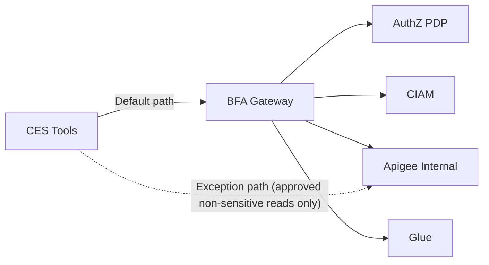

# ADR-0104 Option C: Controlled Direct Apigee Exception Lane

**Status:** Design option deep dive  
**Date:** 2026-02-28  
**Created by:** Codex on 2026-02-28

---

## 1) Option summary

Introduce a narrow exception path:
- Default remains CES -> BFA.
- A small set of explicitly approved non-sensitive read tools may call Apigee directly.
- Glue and sensitive flows remain behind BFA.

Diagram:
- `architecture/diagrams/adr-0104-option-c-controlled-apigee-exception.mmd`

---

## 2) Security view

Potential benefit:
- Reduces hop count for carefully bounded read-only APIs.

Major risks:
- Higher chance of violating ADR-0108 by pushing token/secret handling toward CES config.
- Split policy enforcement and DLP behavior between direct and proxied flows.
- More opportunities for PII minimization inconsistency.

Required controls if adopted:
- Explicit deny-by-default exception registry.
- No long-lived secrets in CES config; strict short-lived credential pattern only if platform supports it.
- Dedicated audit policy for all direct-path invocations.

---

## 3) Network feasibility view

Pros:
- Useful only for Apigee-reachable scenarios.

Limitations:
- Does not solve Glue accessibility constraints from GCP.
- Adds dual operational paths and troubleshooting complexity.

---

## 4) Latency and SLA view

Pros:
- Potential lowest latency for approved direct read scenarios.

Trade-off:
- System-level latency consistency can degrade because two path classes behave differently.
- Tail behavior may become less predictable at fleet level.

---

## 5) Governance view

Pros:
- Can accelerate a subset of teams short-term.

Trade-off:
- Highest governance burden: exception lifecycle, periodic review, drift controls, and policy parity checks.
- Hardest to maintain uniform audit evidence across all domains.

---

## 6) Developer experience view

Pros:
- Maximum short-term autonomy for teams with specific Apigee read use cases.

Trade-off:
- Increases cognitive load for all teams due to dual pattern support.
- Platform guidance, security reviews, and incident response become more complex.

---

## 7) Best-fit conditions

Option C is only viable when:
1. The use case is read-only, non-sensitive, and low-PII.
2. The platform can safely support short-lived credential patterns without static secrets.
3. Security/governance explicitly approve each exception with expiry and review dates.

---

## 8) Open decisions to close

1. Can CES platform enforce secure ephemeral token flow without tool-level secret sprawl?
2. What objective thresholds justify an exception (latency, traffic profile, sensitivity)?
3. Who owns exception review and revocation?

---

## 9) Changelog

| Date | Author | Change |
|---|---|---|
| 2026-02-28 | Codex | Initial Option C deep dive |
