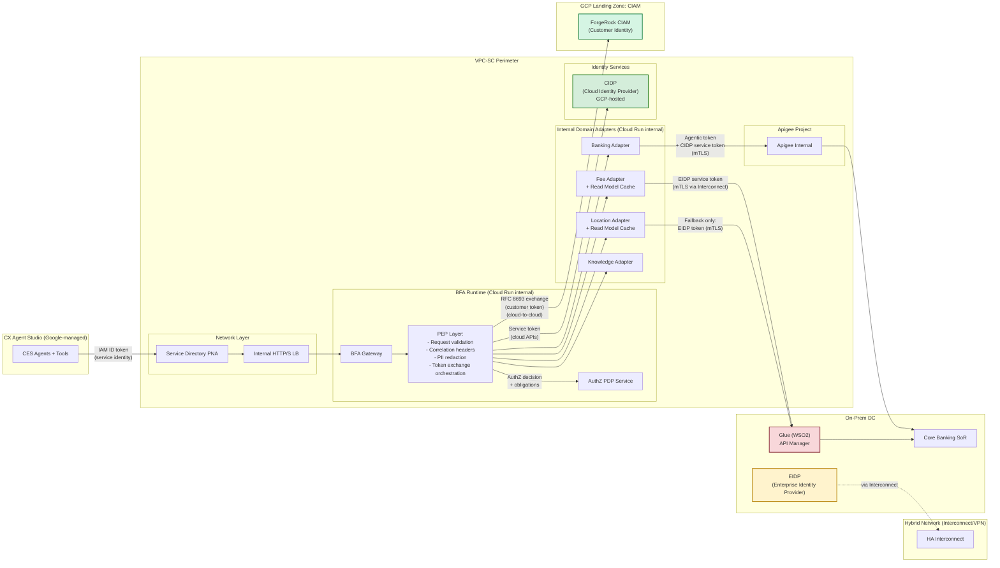
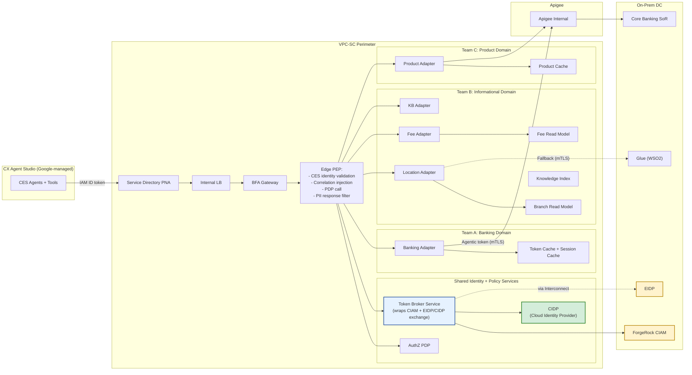
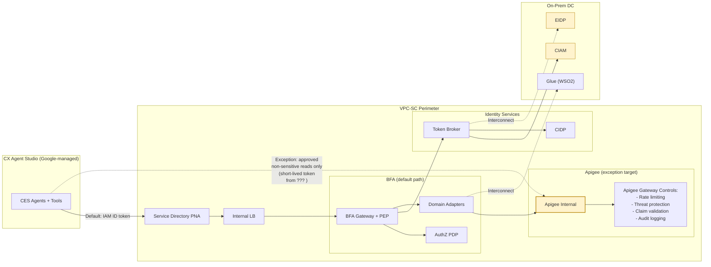

# ADR-0104 Round 2 Review: Backend Topology, Identity Providers, and Agent Data Consumption

**Status:** Review draft — Round 2  
**Date:** 2026-03-01  
**Owner:** Principal Cloud Architect (GCP)  
**Reviewer:** GitHub Copilot (Claude Opus 4.6)  
**Scope:** ADR-0104 + cross-ADR alignment + EIDP/CIDP gap + CES platform constraints + diverging options refresh

---

## Table of Contents

1. [Executive Summary](#1-executive-summary)
2. [ADR-0104 Current Stance Summary](#2-adr-0104-current-stance-summary)
3. [Round 1 vs Round 2 Review Delta](#3-round-1-vs-round-2-review-delta)
4. [Critical Findings: EIDP/CIDP Integration Requirements](#4-critical-findings-eidpcidp-integration-requirements)
5. [CES Platform Constraints Impacting Architecture](#5-ces-platform-constraints-impacting-architecture)
6. [Gap Analysis: ADR-0104 vs Team Expectations and Network Reality](#6-gap-analysis-adr-0104-vs-team-expectations-and-network-reality)
7. [Clarifying Questions (Grouped, Numbered)](#7-clarifying-questions-grouped-numbered)
8. [Revised Diverging Architecture Options](#8-revised-diverging-architecture-options)
9. [Comparative Evaluation Matrix](#9-comparative-evaluation-matrix)
10. [Recommendation](#10-recommendation)
11. [Required Diagram Updates](#11-required-diagram-updates)
12. [Follow-up ADRs and Artifacts](#12-follow-up-adrs-and-artifacts)
13. [Changelog](#13-changelog)

---

## 1) Executive Summary

This second-round review of ADR-0104 was triggered by six concrete constraints that surfaced since the initial architecture review:

1. **Independent agent teams** with separate delivery cycles expect maximum autonomy.
2. **Dual upstream dependency** (Apigee + Glue) with no unified pattern.
3. **Aggressive voice latency SLAs** pushing teams toward local caching.
4. **Glue unreachable from CES/GCP** — a hard network boundary, not just unverified.
5. **Teams attempting direct Apigee connections and CES-level token generation** — an active ADR-0108 violation risk.
6. **No consensus** across teams on the canonical data consumption pattern.

Additionally, this review clarifies the integration requirements for **EIDP (Enterprise Identity Provider) and CIDP (Cloud Identity Provider)** — established components of the enterprise identity landscape that provide the service-to-service tokens required for token exchanges at BFA. Their concrete integration points require explicit representation in diagrams, sequence flows, and ADR documents. As the minting authorities for inbound service identity tokens, EIDP and CIDP are essential to making ADR-0106 (RFC 8693 token exchange) operational.

The review concludes that **ADR-0104's single-ingress model is architecturally sound** but requires significant hardening in four areas: identity provider integration (EIDP/CIDP), CES platform extensibility constraints, caching/freshness contracts, and team operating model.

---

## 2) ADR-0104 Current Stance Summary

ADR-0104 establishes:

| # | Decision | Alignment |
|---|---|---|
| 1 | Single externally visible tool surface: **CES → BFA Gateway** only | ADR-0101 (private ingress via SD PNA + ILB) |
| 2 | Domain adapters are **internal** to BFA, not CES-addressable | ADR-0103 (independent Apigee/Glue upstreams) |
| 3 | BFA is the **mandatory policy boundary** (identity, token, PDP, correlation) | ADR-0107 (layered PEP), ADR-0108 (service-identity-first) |
| 4 | Internal adapters route to Apigee, Glue, or BFA-curated read models per `agent-registry.md` | ADR-0103, ADR-0110, ADR-0111 |
| 5 | **No direct CES-to-adapter or CES-to-upstream topology** as default | ADR-0108 (no secrets in CES config) |

**Explicit non-goals** from ADR-0104:
- No assumption that Glue is reachable from GCP until validated (ADR-0101/0102).
- No forcing of internal packaging model — adapters may be in-process or separate services.

**Cross-ADR dependency chain** (critical path):

```
ADR-0101 (private connectivity) 
  → ADR-0102 (hybrid backbone: Interconnect/VPN)
    → ADR-0104 (single BFA ingress + adapters)
      → ADR-0103 (Apigee/Glue independent routing)
      → ADR-0106 (token exchange via CIAM + EIDP/CIDP)
      → ADR-0107 (layered PEP: BFA primary, Apigee secondary)
      → ADR-0108 (service-identity-first, backend secret custody)
      → ADR-0109 (correlation headers, audit, tracing)
      → ADR-0112 (mTLS everywhere)
```

---

## 3) Round 1 vs Round 2 Review Delta

| Area | Round 1 status (2026-02-28) | Round 2 new findings (2026-03-01) |
|---|---|---|
| **EIDP/CIDP** | Referenced in glossary | **Integration points clarified**: Roles as service-to-service token minting authorities established; diagram and ADR updates needed to represent their concrete integration with BFA and Token Broker |
| **CES platform constraints** | Generic reference to tool integration | **Concrete findings** from `platform-reference.md` and `caveats.md` — Python callbacks cannot do complex token flows; `x-ces-session-context` exists but PII risk; MCP has SSE limitation |
| **Team behavior** | "Some teams expect CES-level token generation" | **Active risk**: Teams are attempting direct Apigee connections and embedding auth logic in CES tool configs |
| **Glue connectivity** | Marked "UNVERIFIED" | Confirmed as **hard network gap** — Glue is not directly accessible from CES agents in GCP |
| **Caching** | "Caching acceptable except balances" | Need **domain-by-domain freshness matrix** and cache ownership model |
| **Token lifecycle** | "Conceptually CIAM via adapter/auth-server" | **No concrete owner**, no EIDP/CIDP integration design, no prototype |
| **Latency** | "p95 under 3 seconds" | Need **per-hop budget allocation** and **cold-start strategy** |

---

## 4) Critical Findings: EIDP/CIDP Integration Requirements

### 4.1 What the glossary says

From `architecture/terminology-glossary.md`:

| Term | Definition |
|---|---|
| **EIDP** | Enterprise Identity Provider — needed to access some Apigee Internal and Glue APIs/backends. Provides both authz and authn services. |
| **CIDP** | Cloud Enterprise Identity Provider — needed to access some Apigee Internal and Glue APIs/backends. Provides both authz and authn services. |
| **CIAM** | Customer Identity and Access Management — used for customer-facing identity |

### 4.2 Where EIDP/CIDP integration points need to be represented

| Document / Diagram | Current state | Required fix |
|---|---|---|
| `context-diagram.mmd` | Shows `ForgeRock CIAM` on-prem (INCORRECT — CIAM is GCP cloud-hosted in a separate landing zone) | Must move CIAM to its own GCP landing zone subgraph. Add EIDP and CIDP nodes with their correct trust boundaries (EIDP is on-prem, CIDP and CIAM are GCP cloud-hosted in separate landing zones). **FIXED in R2 diagrams.** |
| `sequence-balance-inquiry.mmd` | Shows `BFA→CIAM: Token exchange` | Must show whether BFA calls CIAM directly **or** via EIDP/CIDP for the service-to-service token that bootstraps the RFC 8693 exchange |
| `sequence-step-up.mmd` | Shows `BFA→CIAM: Validate auth context` | Missing: EIDP/CIDP role in minting the initial service identity token and post-step-up token refresh |
| `adr-0104-option-a-strict-single-bfa.mmd` | No identity provider nodes at all | Must add EIDP/CIDP as part of the security enforcement layer |
| `adr-0104-option-b-federated-adapters.mmd` | No identity provider nodes at all | Same fix needed |
| `adr-0104-option-c-controlled-apigee-exception.mmd` | Shows `CIAM` but no EIDP/CIDP | Must add EIDP/CIDP, especially for the exception lane token handling |
| `adr-0104-connectivity-unverified.mmd` | Shows `CIAM` on-prem (INCORRECT — CIAM is GCP cloud-hosted) | CIAM moved to GCP landing zone subgraph. EIDP added to on-prem. CIDP added to GCP section. EIDP/Glue connectivity remains UNVERIFIED. **FIXED in R2 diagrams.** |
| `acme_cxstudio_architecture_facts_decisions.md` | Mentions CIAM only | Must introduce EIDP/CIDP in the component model and trust boundaries |
| ADR-0104 (main ADR) | Mentions `CIAM, EIDP` once in Decision section | Needs explicit call-out of EIDP/CIDP roles |
| ADR-0106 (token strategy) | Says "ForgeRock CIAM" as the exchange authority | **Critical**: Must clarify EIDP vs CIDP vs CIAM roles in token exchange chain |
| ADR-0107 (AuthZ PDP) | References token validation at BFA | Must clarify which identity provider is the issuer of the tokens PDP validates |

### 4.3 Questions requiring answers before fixing

> **These are blocking questions — cannot produce correct diagrams without answers.**

| # | Question | Impact if unresolved |
|---|---|---|
| Q-EIDP-1 | **Where does EIDP run?** On-prem alongside Glue, or in a separate DC? | Affects diagram placement and network dependency mapping |
| Q-EIDP-2 | **Where does CIDP run?** In GCP (same project? different project? separate GCP org?) | **CONFIRMED: GCP cloud-hosted in a separate landing zone.** Affects VPC-SC perimeter, IAM bindings, and latency |
| Q-EIDP-3 | **What protocol does BFA use to obtain service-to-service tokens from EIDP/CIDP?** OAuth 2.0 client credentials? mTLS + JWT bearer? Custom? | Affects ADR-0106 token exchange chain design |
| Q-EIDP-4 | **Is EIDP the issuer for tokens presented to Apigee-backed APIs?** Does CIDP issue tokens for GCP-internal services? Or is the split different? | Affects ADR-0107 PDP validation and ADR-0108 service identity model |
| Q-EIDP-5 | **Is EIDP the issuer for tokens presented to Glue-backed APIs?** | Affects BFA→Glue token attachment flow |
| Q-EIDP-6 | **Is CIAM the ONLY customer-facing identity provider, while EIDP/CIDP handle service-to-service only?** Or do EIDP/CIDP also participate in customer token chains? | Fundamental to the token lifecycle architecture |
| Q-EIDP-7 | **Is EIDP reachable from BFA's runtime VPC via Interconnect/VPN?** Same unverified status as Glue? | If EIDP is unreachable, BFA cannot obtain service tokens for Glue-backed calls. **Note: CIAM is GCP cloud-hosted and does NOT share this Interconnect dependency.** |
| Q-EIDP-8 | **Is CIDP reachable from BFA without Interconnect?** (If it's in GCP, it may be reachable via VPC peering or private service access) | **CONFIRMED: Yes — CIDP is GCP cloud-hosted; reachable without Interconnect.** Changes the Phase 1 feasibility picture significantly |

---

## 5) CES Platform Constraints Impacting Architecture

Based on `docs/architecture/cx-agent-studio/platform-reference.md` and `caveats.md`:

### 5.1 Tool integration model

| Tool type | Capability | Relevant constraint |
|---|---|---|
| **OpenAPI toolset** | Maps one callable tool per OpenAPI path operation | Tool configs reference endpoints + optional Secret Manager references. **Cannot perform complex token exchange flows.** |
| **Python function tool** | Local deterministic code | Lightweight; NOT suited for HTTP calls, token management, or secret handling |
| **MCP tool** | Connects to MCP servers | **Limitation: stateless streamable HTTP over SSE is not supported.** Authentication follows same model as OpenAPI tools. |
| **`x-ces-session-context`** | Injects session context (project ID, session ID, custom variables) into API calls | Useful for correlation but **introduces PII risk if customer data is in session variables** |

### 5.2 Callback lifecycle

CES callbacks are Python-based with these hooks:
- `before_model_callback`, `after_model_callback`
- `before_tool_callback`, `after_tool_callback`
- `after_agent_callback`

**Constraint**: Callbacks should be "lightweight and deterministic" (per caveats.md). They can mutate state and override responses, but **heavy logic, HTTP calls, or token management in callbacks is an anti-pattern**.

### 5.3 What this means for the topology decision

| Constraint | Architectural implication |
|---|---|
| CES cannot do complex token exchange | **Validates ADR-0108**: token exchange MUST happen at BFA, not in CES tool configs |
| CES callback cannot safely manage secrets | **Validates ADR-0104**: BFA as single ingress protects CES from secret sprawl |
| MCP SSE limitation | MCP tools cannot stream from BFA; must use request/response patterns |
| `x-ces-session-context` leaks data into API calls | **BFA must strip or redact** session context before forwarding to upstreams |
| CES has no native DLP/PII filtering | **BFA must enforce PII minimization** on responses returned to CES |

### 5.4 CES platform extensibility — open question

> **Q-CES-1**: Has the CES platform been validated for custom library imports in Python callbacks? If not, teams cannot add auth libraries, HTTP clients, or crypto packages in callback code. This constrains any architecture that expects CES-side processing.

---

## 6) Gap Analysis: ADR-0104 vs Team Expectations and Network Reality

### G1: EIDP/CIDP Identity Provider Integration (NEW — CRITICAL)

**Description**: EIDP and CIDP are established components of the enterprise identity landscape that provide service-to-service tokens needed for Apigee and Glue access. Their integration points require explicit representation in diagrams, the ADR-0106 token lifecycle, and supporting ADR documents to complete the token exchange chain between BFA and upstream backends.

**Impact**: ADR-0106's RFC 8693 token exchange pattern requires a concrete minting authority for the subject_token (the service identity token). Documenting EIDP and CIDP's roles in this chain is necessary to make the security model operational.

**Resolution required**: Answers to Q-EIDP-1 through Q-EIDP-8, then diagram and ADR updates.

### G2: Team Direct-Connect Behavior (ESCALATED from Round 1)

**Description**: Some agent teams are actively attempting to:
1. Connect CES tools directly to Apigee, bypassing BFA.
2. Generate auth/authz tokens inside CES tool configurations.

**Conflict with**:
- ADR-0104: No direct CES-to-upstream topology.
- ADR-0108: Service-identity-first, no long-lived secrets in CES tool configs.
- ADR-0107: BFA is primary PEP; direct connections bypass PDP enforcement.

**Root cause hypothesis**: Lack of a working BFA pathway forces teams to find shortcuts. The BFA Gateway may not yet be operational, creating a vacuum.

**Resolution required**: Either (a) accelerate BFA to provide a working path, or (b) define an explicit, time-bounded, governed exception process. See Option C analysis in Section 8.

### G3: Glue Network Boundary — Hard Gap (ESCALATED from Round 1)

**Description**: Round 1 marked Glue connectivity as "UNVERIFIED." It is now confirmed that Glue APIs are **not directly accessible from CES agents running in GCP**. This is a firewall/network boundary constraint, not just an unvalidated path.

**Impact**: All Glue-dependent agents (AG-003 location fallback, AG-005 fees fallback, AG-006 KB fallback, AG-007 banking if partial, AG-004 appointments) cannot operate via live upstream calls until:
1. Cloud Interconnect or VPN is provisioned and validated (ADR-0102).
2. Firewall rules, DNS split-horizon, and mTLS trust chain are established.
3. EIDP reachability from BFA is confirmed (for Glue-bound tokens).

**Mitigation already in ADRs**: Curated read models as Phase 1 primary source for AG-003, AG-005, AG-006, AG-010. But this must be made explicit as the ONLY operational path for Phase 1.

### G4: Caching/Freshness Policy Vacuum (CARRIED from Round 1)

**Description**: ADR-0104 references read models and caching but defines no TTL, invalidation strategy, consistency model, or ownership split (gateway-level vs adapter-level cache).

**Impact**: Without caching contracts, teams will implement inconsistent strategies, some potentially caching sensitive data (balances, transactions) that should not be cached.

**Resolution required**: A dedicated caching/freshness ADR (see Section 12).

### G5: Token Lifecycle Unowned (CARRIED + DEEPENED)

**Description**: Round 1 noted "no implementation owner yet." Round 2 deepens this: the token lifecycle now has THREE identity providers (CIAM, EIDP, CIDP) with undefined roles, responsibilities, and reachability.

**Token flow gaps**:

| Hop | Token needed | Issuer | Status |
|---|---|---|---|
| CES → BFA | IAM ID token (service identity) | GCP IAM | Defined in ADR-0108; relatively clear |
| BFA → CIAM | Subject token for RFC 8693 exchange | CIAM (ForgeRock) | CIAM is GCP cloud-hosted (separate landing zone) — cloud-to-cloud connectivity (mechanism TBD: PSC, VPC peering, or other). **NOT on-prem; does NOT depend on Interconnect.** |
| BFA → EIDP | Service-to-service token for Glue-bound calls | EIDP | **NOT DEFINED** — EIDP not in any sequence diagram |
| BFA → CIDP | Service-to-service token for Apigee-bound calls | CIDP | **NOT DEFINED** — CIDP not in any sequence diagram |
| BFA → Apigee | Agentic access token | Minted by BFA via CIAM/CIDP exchange | Exchange chain incomplete |
| BFA → Glue | Agentic access token | Minted by BFA via CIAM/EIDP exchange | Exchange chain incomplete; EIDP reachability unknown |
| BFA → AuthZ PDP | Bearer or mTLS identity | BFA service identity or CIDP-issued | **NOT DEFINED** |

### G6: Team Operating Model (CARRIED from Round 1)

**Description**: ADR-0104 preserves team ownership of internal adapters but does not define:
- Release contracts between gateway and adapters.
- Conformance test requirements.
- Shared middleware/SDK distribution strategy (Java, Python, Node.js stacks).
- On-call boundaries.

This gap is particularly acute given the mixed-stack teams (Java, Python, Node.js).

### G7: PII/DLP at CES Boundary (NEW)

**Description**: CES caveats document explicitly warns: *"Sensitive data may be available in prompt context unless aggressively minimized."* The `x-ces-session-context` annotation can inject session variables (including `customer_profile`) into API calls. CES has no native DLP filtering.

**Impact**: If BFA returns unredacted customer data to CES, that data may:
1. Persist in CES conversation history (BigQuery export, Cloud Logging).
2. Be available in prompt context for subsequent turns.
3. Leak through `x-ces-session-context` to unrelated tool calls.

**Resolution required**: BFA must enforce strict PII minimization BEFORE returning responses to CES. This needs to be a first-class design constraint, not an afterthought.

---

## 7) Clarifying Questions (Grouped, Numbered)

### A) Identity Providers (EIDP / CIDP) — BLOCKING

| # | Question | Default assumption (if unanswered) | Related ADR |
|---|---|---|---|
| A1 | Where does EIDP physically run? (on-prem DC, separate DC, cloud?) | On-prem alongside Glue (worst case for latency) | ADR-0102, ADR-0106 |
| A2 | Where does CIDP physically run? (GCP project, separate GCP org, hybrid?) | **CONFIRMED:** GCP-hosted in a separate landing zone | ADR-0106, ADR-0108 |
| A3 | What protocol does BFA use to obtain service tokens from EIDP/CIDP? (OAuth2 client_credentials, mTLS + JWT bearer, SAML, custom?) | OAuth2 client_credentials over mTLS | ADR-0106, ADR-0112 |
| A4 | Which identity provider issues tokens for Apigee-backed API calls? EIDP, CIDP, or CIAM? | CIDP for Apigee (cloud-to-cloud) | ADR-0106, ADR-0107 |
| A5 | Which identity provider issues tokens for Glue-backed API calls? EIDP, CIDP, or CIAM? | EIDP for Glue (on-prem) | ADR-0106, ADR-0107 |
| A6 | Is CIAM exclusively customer-facing, while EIDP/CIDP are service-to-service only? | Yes — CIAM for customer tokens, EIDP/CIDP for service tokens | ADR-0106 |
| A7 | Is the RFC 8693 token exchange done CIAM → BFA (customer token in, agentic token out), and then BFA separately obtains a service token from EIDP/CIDP to attach when calling upstreams? | Yes — two separate token flows | ADR-0106 |
| A8 | Is EIDP reachable from BFA's runtime VPC today? (Same unverified status as Glue?) | UNVERIFIED — same dependency on Interconnect/VPN | ADR-0102 |
| A9 | Is CIDP reachable from BFA without Interconnect? (VPC peering? Private Service Connect?) | **CONFIRMED:** Reachable via private networking within GCP (cloud-to-cloud) | ADR-0101 |

### B) Network Connectivity — HIGH PRIORITY

| # | Question | Default assumption | Related ADR |
|---|---|---|---|
| B1 | Is Cloud Interconnect provisioned and active for BFA's runtime VPC? | No — still in procurement/provisioning | ADR-0102 |
| B2 | Is Cloud VPN configured and tested as PoC/fallback path? | No — not yet configured | ADR-0102 |
| B3 | Is private DNS resolution to Glue hostnames available from BFA's VPC? | No — requires split-horizon DNS setup | ADR-0102 |
| B4 | Are firewall rules validated bidirectionally (BFA→Glue, BFA→EIDP)? Note: BFA→CIAM and BFA→CIDP are cloud-to-cloud (no Interconnect) | No — not validated | ADR-0102 |
| B5 | What is the expected network latency between BFA in GCP and Glue on-prem once Interconnect is active? (p50, p95) | p50 ~5ms, p95 ~15ms for Interconnect; p50 ~20ms, p95 ~50ms for VPN | ADR-0102 |
| B6 | Is Apigee Internal reachable from BFA via private networking today? | Likely yes via PSC/VPC peering — needs confirmation | ADR-0101, ADR-0103 |

### C) Latency and SLA Budget — HIGH PRIORITY

| # | Question | Default assumption | Related ADR |
|---|---|---|---|
| C1 | What is the total voice turn latency target? (user speaks → voice response begins) | p95 < 3 seconds end-to-end (from Round 1) | ADR-0104 |
| C2 | How is the 3-second budget allocated? (CES processing + BFA round-trip + upstream round-trip + TTS) | Unknown — need explicit per-hop budget | ADR-0105 |
| C3 | What are p50 and p99 targets? | p50 < 1.5s, p99 < 5s (assumed, not confirmed) | ADR-0104 |
| C4 | Are sensitive operations (balance, transfer) given separate, longer budgets? | Unknown | ADR-0107 |
| C5 | What is the timeout/fallback behavior when upstream latency exceeds budget? (graceful degradation message? retry? fail?) | Fail with user-friendly message (assumed) | ADR-0104 |
| C6 | What is the Cold start mitigation strategy budget? Will minimum instances be funded for BFA and critical adapters? | Unknown — cost implications | ADR-0105 |

### D) Caching and Data Freshness — MEDIUM PRIORITY

| # | Question | Default assumption | Related ADR |
|---|---|---|---|
| D1 | Which domains can serve stale data? | All informational domains (location, fees, KB, products); NOT balances/transactions/cards | ADR-0110 |
| D2 | What are acceptable TTLs by domain? | Fees: 24h; Location: 1h; KB: 6h; Products: 4h (assumed) | ADR-0110 |
| D3 | What invalidation strategy? (time-based only, event-driven, mixed?) | Time-based for Phase 1; event-driven for Phase 2 (assumed) | — |
| D4 | Who owns the cache? (BFA gateway-level? per-adapter? both?) | Per-adapter with BFA cache-control headers (assumed) | ADR-0104 |
| D5 | Can adapters use in-memory cache, or must caching be externalized (Memorystore, Cloud Storage)? | In-memory for Phase 1 with externalized cache for HA in Phase 2 (assumed) | ADR-0105 |
| D6 | Are curated read models (branches.json, fees model) refreshed on a schedule, and what is the SLA for refresh? | Unknown — needs definition | ADR-0110 |

### E) Token Lifecycle — MEDIUM PRIORITY (dependent on Section A answers)

| # | Question | Default assumption | Related ADR |
|---|---|---|---|
| E1 | Who mints the CES→BFA service identity token? | GCP IAM (ID token from CES service account) | ADR-0108 |
| E2 | Who mints the agentic customer token? (BFA via RFC 8693 exchange with CIAM?) | BFA performs exchange; CIAM issues token | ADR-0106 |
| E3 | What is the expected TTL for the agentic token? | 5-15 minutes (short-lived, session-scoped) | ADR-0106 |
| E4 | Where are service-to-service credentials for EIDP/CIDP stored? | Secret Manager (ADR-0108) or workload identity federation | ADR-0108 |
| E5 | Is token caching/reuse allowed within a session for multiple tool calls? | Yes within session TTL, no cross-session | ADR-0106 |
| E6 | Has any team attempted to configure OAuth client credentials in CES tool configs? | Unknown — needs audit | ADR-0108 |

### F) CES Platform Capabilities — MEDIUM PRIORITY

| # | Question | Default assumption | Related ADR |
|---|---|---|---|
| F1 | Can CES Python callbacks import arbitrary packages (e.g., `requests`, `google-auth`, cryptographic libraries)? | No — sandboxed environment with limited imports | — |
| F2 | Does CES support custom HTTP headers on OpenAPI tool calls beyond `x-ces-session-context`? | Unknown — critical for correlation header propagation (ADR-0109) | ADR-0109 |
| F3 | Can CES tool configs reference Secret Manager secrets for OAuth client_credentials flows? | Yes (per platform docs), but this is exactly what ADR-0108 tries to avoid | ADR-0108 |
| F4 | Is there a CES-native mechanism to redact or filter response payloads before they enter prompt context? | Possibly via `after_tool_callback`, but heavyweight redaction in callback is an anti-pattern | — |
| F5 | What is the maximum response payload size for CES tool calls? | Unknown — could constrain transaction history or statement responses | ADR-0104 |

### G) Team Operating Model — LOWER PRIORITY

| # | Question | Default assumption | Related ADR |
|---|---|---|---|
| G1 | Is there a dedicated BFA platform team, or is BFA shared ownership? | Unknown — critical for Option B viability | ADR-0104 |
| G2 | What is the team distribution by language? (How many Java, Python, Node.js teams?) | Mixed — at least Java and Python | — |
| G3 | Is there a shared CI/CD pipeline or does each team have independent delivery infrastructure? | Independent with shared Terraform Enterprise | — |
| G4 | Who is on-call for BFA? For individual adapters? | Unknown | ADR-0104 |
| G5 | Is there an existing adapter template or starter kit? | No — needs to be created | ADR-0104 |

### H) Precedent and Pilots — INFORMATIONAL

| # | Question | Default assumption | Related ADR |
|---|---|---|---|
| H1 | Has any team successfully called an Apigee API from behind BFA? | No pilot exists | ADR-0103 |
| H2 | Has any team successfully called a Glue API from BFA's VPC? | No — Glue unreachable | ADR-0102 |
| H3 | Has any team measured end-to-end latency for a CES→BFA→upstream round-trip? | No baseline exists | ADR-0104 |
| H4 | Has a CES tool audit revealed any embedded secrets or OAuth configs? | Not yet performed | ADR-0108 |

---

## 8) Revised Diverging Architecture Options

### Option A: Strict Single BFA Gateway (ADR-0104 as-is, with EIDP/CIDP + hardening)

**Core idea**: All CES tool traffic goes through BFA. BFA handles all identity, authorization, correlation, PII redaction, caching, and upstream routing. EIDP/CIDP are integrated as backend identity services called by BFA.

#### Revised Diagram (with EIDP/CIDP)



#### Pros
- **Security**: Strongest central governance. All token exchange (CIAM, EIDP, CIDP) happens at BFA. No secrets in CES. Single PII redaction boundary. ADR-0108 fully enforced.
- **Network**: CES is isolated from all hybrid network complexity. Only BFA needs Interconnect/VPN access.
- **Governance**: Single audit trail. One correlation header injection point. Uniform fail-closed behavior.
- **PII/DLP**: BFA can enforce PII minimization before any data reaches CES prompt context.

#### Cons
- **Latency**: Every tool call traverses BFA (gateway + PEP + adapter + upstream). Additional hop for EIDP/CIDP token acquisition. Estimated +20-80ms overhead per call.
- **DX**: Teams depend on BFA platform team for gateway changes. Mixed-stack adapter development needs shared libraries/SDKs.
- **Blast radius**: BFA outage impacts all agents and all domains.
- **Delivery velocity**: BFA must be operational before any agent can work end-to-end.

#### When this option is best
- Security and compliance are non-negotiable priorities.
- A dedicated BFA platform team exists or can be staffed.
- Latency budget can absorb the additional hop.

---

### Option B: Single Ingress + Federated Adapters with Domain Cache Planes + Explicit EIDP/CIDP

**Core idea**: CES still calls only BFA. BFA handles identity/PDP/obligations at the edge. But domain adapters are fully team-owned Cloud Run services with their own cache planes, lifecycle, and (potentially) their own EIDP/CIDP token management delegated from BFA.

#### Revised Diagram (with EIDP/CIDP)



#### Key differentiator: Token Broker Service

Option B introduces a **shared Token Broker Service** that encapsulates the complexity of CIAM + EIDP + CIDP token exchange. This service:
1. Accepts a validated customer context from BFA edge PEP.
2. Performs RFC 8693 exchange with CIAM for customer-context tokens.
3. Obtains service-to-service tokens from EIDP (for Glue-bound calls) or CIDP (for Apigee-bound calls).
4. Returns a combined token package to the requesting adapter.
5. Handles token caching, rotation, and TTL management centrally.

This way, individual adapter teams do NOT need to know how to talk to EIDP/CIDP/CIAM.

#### Pros
- **Security**: Preserves single ingress and central PEP at BFA edge. Token complexity is centralized in Token Broker Service. ADR-0108 enforced.
- **DX**: Highest team autonomy. Each adapter team owns their domain logic, cache strategy, and release cycle.
- **Latency**: Best opportunity for domain-specific optimization (pre-populated read models, hot caches, connection pooling). Token Broker can cache service tokens.
- **Governance**: Centralized policy at edge + shared conformance suite. Token Broker provides a consistent interface regardless of upstream.

#### Cons
- **Complexity**: More services to operate (BFA edge + Token Broker + N adapters + PDP).
- **Platform investment**: Requires shared adapter templates, SDK distribution, conformance CI gates.
- **Token Broker becomes critical**: Another shared dependency alongside BFA.
- **Mixed-stack friction**: Token Broker client libraries needed for Java, Python, Node.js.

#### When this option is best
- Multiple teams with independent delivery cycles and mixed stacks.
- A platform team can invest in Token Broker Service and adapter templates.
- Latency optimization per domain is critical for meeting voice SLAs.

---

### Option C: Controlled Exception Lane — Direct CES→Apigee for Approved Non-Sensitive Reads + EIDP/CIDP Governance

**Core idea**: BFA remains the default path. A narrow, explicitly governed exception allows specific CES tools to call Apigee Internal directly for approved non-sensitive, low-PII read-only operations. Glue and sensitive operations always go through BFA.

#### Revised Diagram (with EIDP/CIDP)



#### Critical Problem with Option C: Token Source for Exception Lane

The exception lane creates an **unsolved token problem**:
- If CES calls Apigee directly, who provides the token?
  - **Not CIAM** — CES cannot perform RFC 8693 exchange (platform constraint).
  - **Not CIDP** — CES cannot obtain service tokens (no API library in callbacks).
  - **Secret Manager reference?** — ADR-0108 explicitly discourages this.
  - **CES service identity only?** — Apigee would need to accept GCP IAM tokens directly, bypassing customer-context authorization entirely.

**CES Python environment constraints reinforce this problem.** CES executes tools in a sandboxed Python environment that does not guarantee access to arbitrary third-party libraries. Complex token-acquisition logic (OAuth 2.0 client-credentials flows, JWT signing, mTLS handshakes) cannot be embedded in the CES tool layer. This has two implications for the exception lane:

- **Apigee API Keys (BYOK) are a viable narrow path.** For backend endpoints that do not require user-delegated credentials, an Apigee API Key authenticates the calling application — not the user. CES tool configs can reference an API key via Secret Manager, sidestepping the token-exchange problem entirely. This works for non-sensitive, non-PII reads where customer-context authorization is not required.
- **Token Broker in the BFA Landing Zone is a viable second path.** The Token Broker Service can mint CIDP/EIDP service tokens on behalf of CES tools. CES calls the Token Broker (a lightweight HTTP call to a Landing Zone endpoint), receives a short-lived service token, and attaches it to the subsequent direct Apigee call. This broadens the exception lane beyond API-key-only use cases to include non-critical flows that require service-level authentication (e.g., endpoints behind Apigee that validate CIDP-issued tokens). The trade-off: this reintroduces a BFA Landing Zone dependency on every exception-lane call (CES → Token Broker → CES → Apigee), adding one extra hop. The latency benefit over the full BFA path is still meaningful (~2 hops vs ~3-4), because the request bypasses the BFA Gateway's PEP/PDP chain and adapter routing.
- **Customer-context authorization remains BFA-only.** For backends that require user-delegated credentials (e.g., account balance, transactions), neither API keys nor Token-Broker-minted service tokens suffice — only the RFC 8693 exchange through BFA/CIAM provides customer-scoped tokens. These flows cannot use the exception lane.

This analysis defines two tiers of viable exception-lane use cases:

| Tier | Token source | Scope | Example |
|------|-------------|-------|---------|
| **Tier 1 — API key** | BYOK via Secret Manager | Non-sensitive reads, zero PII, no auth context | Public branch locator, product catalog |
| **Tier 2 — Token Broker** | CIDP/EIDP service token via Landing Zone Token Broker | Non-critical service-authenticated reads, low PII risk | Fee schedules behind Apigee, non-personalized rates |
| **Not viable** | — | Any flow requiring customer-context authorization | Balances, transactions, transfers, cards |

All customer-context flows must go through BFA — which reinforces why the single BFA Gateway endpoint (Option C's default path, and Options A/B entirely) is the correct pattern for critical operations: credential complexity is absorbed server-side, keeping the CES tool layer thin and stateless.

This means Option C operates in one of three modes:
1. **Tier 1 — API key only.** CES tool config references an API key via Secret Manager. No token exchange, no runtime dependency on BFA. Simplest path, narrowest scope.
2. **Tier 2 — Token Broker pre-mint.** CES calls the Token Broker in the BFA Landing Zone to obtain a short-lived service token, then calls Apigee directly with that token. Adds one hop but avoids BFA Gateway's full PEP/PDP chain. Viable for non-critical, service-authenticated flows.
3. **Not viable without BFA.** Any flow requiring customer-context authorization (RFC 8693 exchange, user-delegated scopes) must use the BFA default path.

#### Pros
- **Latency**: Lowest hop count for exception-lane calls. Tier 1 (API key): ~1 hop, zero token-exchange overhead. Tier 2 (Token Broker): ~2 hops (CES → Token Broker → CES → Apigee), still faster than the full BFA path (~3-4 hops) because it bypasses PEP/PDP/adapter routing.
- **Short-term velocity**: Unblocks non-critical read-only use cases without waiting for full BFA Gateway readiness. Tier 1 requires no Token Broker at all; Tier 2 requires only the Token Broker, not the full BFA Gateway + adapter stack.
- **CES simplicity**: For Tier 1, the CES tool configuration is minimal — API key reference, no token flow, no callback logic, no library imports. For Tier 2, the CES tool makes one additional pre-call to Token Broker but still avoids complex auth code in the Python sandbox.

#### Cons
- **Security**: Weaker than Options A/B. Tier 1 provides application-level identity only (no customer context). Tier 2 provides service-level identity via Token Broker but still no customer-context authorization. PII minimization not enforced on direct responses — BFA's Response PEP is bypassed. ADR-0108 is partially satisfied (API key or Token Broker token, both via managed mechanisms) but the service-identity-first posture is diluted compared to the full BFA path.
- **CES Python sandbox limits escalation path**: If an exception-lane use case evolves to require customer-context tokens (e.g., a previously non-sensitive endpoint adds customer-specific data), neither Tier 1 nor Tier 2 can absorb this. The tool must be migrated back to the BFA path — a disruptive change that invalidates the exception approval.
- **Governance**: Two distinct audit paths. Policy drift between BFA-path and direct-path is near-certain. Each exception requires ongoing review to confirm the endpoint has not added PII or customer-context requirements.
- **DLP/PII**: Responses from Apigee go directly into CES prompt context without BFA redaction. Any PII inadvertently added to the Apigee response will persist in CES conversation logs.
- **Network**: Does not solve Glue access at all. Glue-backed APIs always require the BFA→Interconnect→Glue path.
- **Maintainability**: Exception governance lifecycle (approval, review, revocation) adds permanent overhead. The narrower the viable scope (API-key-only, zero-PII), the harder it is to justify the governance investment for so few use cases.
- **EIDP/CIDP**: Exception lane completely bypasses the EIDP/CIDP token model. If the endpoint later requires EIDP/CIDP-issued tokens, the exception is no longer viable.

#### When this option is viable (narrow conditions)
1. The excepted endpoint is non-critical: either truly public/non-sensitive (Tier 1 — API key) or service-authenticated but not customer-context-dependent (Tier 2 — Token Broker). Returns zero or low PII.
2. Apigee enforces its own rate limiting, threat protection, claim validation, and audit logging independently of BFA.
3. The CES tool configuration uses either an API key (Tier 1) or a Token Broker pre-call (Tier 2) — no OAuth flows, no complex token exchange, no custom Python auth code in callbacks.
4. Security team explicitly approves with time-bound governance and expiry (max 90 days, renewable with review).
5. No more than 2-3 exceptions exist simultaneously.
6. A documented escalation path exists: if the endpoint's auth or PII requirements change (e.g., customer-context authorization becomes needed), the tool is migrated back to the BFA path within one sprint.

---

## 9) Comparative Evaluation Matrix

| Criterion | Option A: Strict Single BFA | Option B: Federated + Token Broker | Option C: Exception Lane |
|---|---|---|---|
| **Security (ADR-0106/0107/0108)** | ★★★★★ Strongest. All tokens managed at BFA. Single PEP boundary. | ★★★★☆ Strong. Token Broker centralizes EIDP/CIDP/CIAM. Edge PEP enforced. Small drift risk at adapter level. | ★★☆☆☆ Weakest. Exception lane has unsolved token problem. Split PEP enforcement. |
| **PII/DLP protection** | ★★★★★ BFA redacts before CES receives data. | ★★★★☆ BFA edge redacts. Adapter-level redaction must be conformance-tested. | ★★☆☆☆ Direct Apigee responses enter CES unredacted. |
| **EIDP/CIDP integration** | ★★★★☆ Clear integration point at BFA. But single implementation = single risk. | ★★★★★ Token Broker Service provides clean abstraction over EIDP/CIDP/CIAM complexity. Reusable across adapters. | ★★☆☆☆ Only BFA path uses EIDP/CIDP; exception lane bypasses entirely. |
| **Network feasibility (ADR-0101/0102)** | ★★★★☆ Only BFA needs hybrid access. CES isolated. But BFA→Glue still unverified. | ★★★★☆ Same as A, plus Token Broker→EIDP needs Interconnect. | ★★★☆☆ Does not solve Glue access. Apigee direct access may need separate SD registration. |
| **Latency / Voice SLA** | ★★★☆☆ Additional hops (BFA + adapter + token exchange + upstream). Needs cold-start mitigation and caching. | ★★★★☆ Best latency potential via domain-specific caching and Token Broker token caching. | ★★★★★ Lowest hop count for exception-lane calls. But only applies to 2-3 use cases. |
| **Governance / Audit (ADR-0107/0109)** | ★★★★★ Single audit stream. Easiest compliance evidence. | ★★★★☆ Centralized edge audit + per-adapter tracing. Requires conformance suite. | ★★☆☆☆ Dual audit paths. Exception governance overhead. Drift risk. |
| **Developer Experience** | ★★★☆☆ Teams depend on BFA platform team. Mixed-stack support needed. | ★★★★★ Highest autonomy. Teams own adapters end-to-end with shared Token Broker + templates. | ★★★★☆ Short-term autonomy for exception users. Long-term complexity for all. |
| **Delivery velocity** | ★★☆☆☆ Blocked until BFA and Token exchange are operational. | ★★★☆☆ Can start with read-model adapters while Token Broker is built. | ★★★★☆ Fastest for approved read-only cases. But exception governance takes time too. |
| **CES platform compatibility** | ★★★★★ CES sees only one tool endpoint (BFA). Minimal CES-side config. | ★★★★★ Same external contract. CES sees only BFA. | ★★★☆☆ CES must have two tool endpoints configured. Token source for direct path is problematic. |
| **Scalability (more agents)** | ★★★★☆ Scales linearly by adding adapters behind BFA. But BFA itself must scale. | ★★★★★ Best scalability. Each team independently scales their adapter. Token Broker scales horizontally. | ★★★☆☆ Each exception requires governance review. Does not scale for many domains. |

---

## 10) Recommendation

### Primary recommendation: **Option B** (Federated Adapters + Token Broker Service + BFA Edge PEP)

**Rationale**:

1. **Best fit for team structure**: Independent agent teams with separate delivery cycles map naturally to domain-owned adapters.
2. **Solves the EIDP/CIDP integration gap cleanly**: Token Broker Service abstracts the three-identity-provider complexity (CIAM + EIDP + CIDP) behind one internal API.
3. **Preserves ADR-0104 single ingress**: CES still sees only BFA. No ADR violations.
4. **Best latency potential**: Domain caches + Token Broker token caching reduce redundant upstream and identity calls.
5. **Supports mixed stacks**: Token Broker is consumed via a standard HTTP API, not language-specific SDKs.
6. **PII protection**: BFA edge PEP applies PII redaction before CES receives data.

### Implementation phasing

| Phase | Deliverable | Enables |
|---|---|---|
| **Phase 1a (immediate)** | BFA Gateway skeleton + Edge PEP (validation, correlation injection, PII redaction) | CES→BFA connectivity validation |
| **Phase 1b (weeks 2-4)** | Curated read-model adapters (location, fees, KB) — no upstream calls needed | AG-003, AG-005, AG-006, AG-010 operational with BFA read models |
| **Phase 1c (weeks 4-8)** | Token Broker Service v1 (CIDP integration for Apigee-bound calls, CIAM exchange) | AG-009 (products via Apigee), AG-007 (banking via Apigee) unblocked |
| **Phase 1d (weeks 6-10)** | Interconnect/VPN operational + EIDP integration in Token Broker | Glue-dependent adapter fallback paths operational |
| **Phase 2** | Full write-capable adapters with step-up enforcement | AG-007/AG-008 sensitive operations live |

### Keep Option A as fallback

If a dedicated platform team cannot be staffed for Token Broker + adapter templates, fall back to Option A (strict single BFA) where all token and adapter logic lives inside BFA.

### Reject Option C as default

Option C should be available **only** as a formal exception with:
- Explicit security sign-off
- Time-bound approval (max 90 days, renewable with review)
- Scope limited to ≤ 3 truly non-sensitive, zero-PII read-only APIs
- CES audit showing no embedded secrets
- Apigee-side rate limiting, claim validation, and independent audit logging

---

## 11) Required Diagram Updates

All existing diagrams need EIDP and CIDP added. The following table lists specific changes needed:

| File | Required change |
|---|---|
| `architecture/diagrams/context-diagram.mmd` | Move CIAM to its own `GCP Landing Zone: CIAM` subgraph (NOT on-prem). Add EIDP node (on-prem, alongside Glue). Add CIDP node (GCP, inside or adjacent to AppProj). Show BFA→EIDP (via Interconnect) and BFA→CIDP (cloud-to-cloud) and BFA→CIAM (cloud-to-cloud) connections. Label trust boundaries. **FIXED in R2 update.** |
| `architecture/diagrams/sequence-balance-inquiry.mmd` | Add EIDP/CIDP participant. Show BFA→CIDP (service token for Apigee) before BFA→AP call. Clarify BFA→CIAM is for customer token exchange. |
| `architecture/diagrams/sequence-step-up.mmd` | Add EIDP/CIDP. Show token refresh after step-up includes CIDP service token re-acquisition. |
| `architecture/diagrams/sequence-branch-lookup.mmd` | Add EIDP participant for Glue fallback path (BFA→EIDP→Glue token). |
| `architecture/diagrams/sequence-fee-lookup.mmd` | Same as branch lookup — EIDP for Glue fallback. |
| `architecture/diagrams/adr-0104-option-a-strict-single-bfa.mmd` | Add EIDP and CIDP nodes connected to BFA/PEP layer. |
| `architecture/diagrams/adr-0104-option-b-federated-adapters.mmd` | Add Token Broker Service node with connections to CIAM, EIDP, CIDP. |
| `architecture/diagrams/adr-0104-option-c-controlled-apigee-exception.mmd` | Add EIDP/CIDP to BFA path. Mark exception lane token source as "UNSOLVED / REQUIRES GOVERNANCE." |
| `architecture/diagrams/adr-0104-connectivity-unverified.mmd` | Move CIAM to GCP landing zone subgraph. Add EIDP to on-prem section. Add CIDP to GCP section. Mark EIDP/Glue connectivity as UNVERIFIED. CIAM/CIDP are cloud-hosted — no Interconnect dependency. **FIXED in R2 update.** |

### Documents requiring EIDP/CIDP text updates

| Document | Required change |
|---|---|
| `architecture/acme_cxstudio_architecture_facts_decisions.md` | Add EIDP and CIDP in Section 4.1 component model under Identity Services. Add to Section 4.2 trust boundaries. Add to Section 5.2 agent→source matrix notes. |
| `architecture/adrs/ADR-0106-*` | Expand token exchange flow to explicitly name EIDP/CIDP roles. Define which provider issues which token type. |
| `architecture/adrs/ADR-0107-*` | Clarify which identity provider is the issuer of tokens that PDP validates. |
| `architecture/adrs/ADR-0108-*` | Add guidance on EIDP/CIDP credential storage (service accounts, workload identity federation, Secret Manager). |
| `architecture/addendum-security-auth-phases.md` | Add EIDP/CIDP in Phase 1/Phase 2 hardening descriptions. |

---

## 12) Follow-up ADRs and Artifacts

| # | ADR / Artifact | Priority | Description |
|---|---|---|---|
| 1 | **ADR-01xx: Token Lifecycle & Identity Provider Integration** | P0 — BLOCKING | Define EIDP/CIDP/CIAM roles, token flows, minting authority, TTL, caching, and storage. This is the keystone for making ADR-0106 operational. |
| 2 | **ADR-01xx: Voice-SLA Caching and Freshness Model** | P0 | Define per-domain TTL, invalidation, consistency, and cache ownership (gateway vs adapter). |
| 3 | **ADR-01xx: Token Broker Service Design** | P1 (if Option B) | Inner architecture of the Token Broker: CIAM exchange, EIDP/CIDP integration, caching, HA, failure modes. |
| 4 | **ADR-01xx: CES Direct-Path Exception Governance** | P1 | Default-deny policy for direct CES→upstream. Formal exception process with security sign-off, scope, and expiry. |
| 5 | **ADR-01xx: PII Minimization at BFA Boundary** | P1 | Define what data BFA may return to CES, redaction rules, CES prompt-context data hygiene. |
| 6 | **ADR-0104 addendum: Adapter Operating Model** | P2 | Release contracts, conformance suite, shared middleware distribution, on-call boundaries. |
| 7 | **Network Readiness Checklist** | P0 — BLOCKING | Artifact (not ADR) tied to ADR-0101/0102. Interconnect/VPN status, firewall rules, DNS, mTLS trust chain, EIDP reachability. |
| 8 | **CES Platform Capability Validation** | P1 | Validate: callback sandbox limits, custom header support, response size limits, Secret Manager integration behavior. |

---

## 13) Changelog

| Date | Author | Change |
|---|---|---|
| 2026-02-28 | Codex | Round 1 review with diverging options |
| 2026-03-01 | GitHub Copilot (Claude Opus 4.6) | Round 2 review: EIDP/CIDP gap identification, CES platform constraint analysis, revised options with Token Broker, 48 clarifying questions, and phased recommendation |
