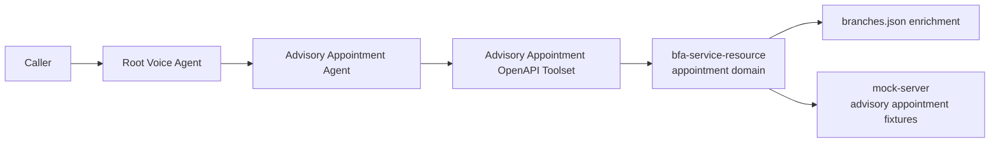

# High-Level Advisory Subagent Architecture

**Status:** Baseline for AGENT-007 build  
**Date:** 2026-03-15  
**Related Plan:** `ces-agent/docs/advisory-agent/implementation-plan/AGENT-007-appointment-context.md`
**Related Diagram:** `ces-agent/docs/advisory-agent/architecture/diagrams/high-level-advisory-subagent-architecture.drawio`

## Goal

Define the high-level architecture for the advisory appointment subagent so backend, CES, and mock-server work all target the same logical system.

## Scope

This architecture covers the preparation-phase booking domain:

- product consultation booking
- service-request booking
- branch, phone, and video channels
- retrieve, cancel, and reschedule in mock mode

It does not cover the future `bfa-gateway -> AG-004 -> Glue` cutover path in full execution detail. That future seam is only captured here at the resource level so the advisory system boundaries stay explicit.

## Layered View

## Component Responsibilities

| Component | Responsibility |
|-----------|----------------|
| Root voice agent | Detects appointment intent and transfers control |
| `advisory_appointment_agent` | Orchestrates the conversation, asks one question at a time, and enforces summary confirmation |
| CES OpenAPI toolset | Binds the agent to the appointment REST contract |
| `bfa-service-resource` appointment domain | Canonical CES-facing contract, validation, orchestration, and mutable mock-mode state overlay |
| `branches.json` enrichment | Canonical physical branch identity, address, and accessibility metadata |
| `mock-server` | Immutable upstream taxonomy, eligibility, slot templates, lifecycle templates, and negative scenarios |

## Future Gateway-Accessible Resources

When the internal advisory cutover is activated, the gateway-side advisory path should treat these as the canonical upstream resources:

| Resource | Role in advisory flows |
|----------|------------------------|
| `FaceCC API` | Advisory repository for appointments, calendars, and advisors |
| `PartnerData API` | Source for client-related details in flows where partner or customer context is required |
| `bfa-gateway` + AG-004 advisory adapter | Gateway-accessible mediation layer that composes `FaceCC API` and `PartnerData API` behind the CES-facing contract |

## Request Flow

### New Booking

1. Root agent transfers to `advisory_appointment_agent`.
2. The advisory agent chooses the next tool call based on missing structured context.
3. CES calls `bfa-service-resource` using the appointment toolset.
4. `bfa-service-resource` enriches upstream appointment results with branch metadata where needed.
5. `mock-server` supplies deterministic upstream responses.
6. `bfa-service-resource` applies validation and mock-mode runtime overlay before returning the contract response.
7. The advisory agent presents concise options and only books after explicit confirmation.

### Lifecycle Change

1. The advisory agent retrieves the appointment with `appointmentId + appointmentAccessToken`.
2. It confirms the requested cancel/reschedule action with the caller.
3. `bfa-service-resource` enforces timing and state rules in the runtime overlay.
4. The updated appointment state is returned to CES.

## Data Ownership

| Data Type | Owner |
|-----------|-------|
| Taxonomy, service catalog, eligibility seeds, slot templates | `mock-server` |
| Physical branch metadata | `branches.json` in `bfa-service-resource` |
| Runtime mock appointment state | `bfa-service-resource` in-memory overlay |
| Conversation state and prompt logic | CES advisory agent |

## Key Design Constraints

- The advisory agent must not behave like a generic branch finder.
- Day selection comes before time-slot selection.
- Create, cancel, and reschedule require spoken summary confirmation.
- No customer legitimation or consent gate is used in H1 mock mode.
- Lifecycle operations require `appointmentAccessToken`.

## Future Extension Seam

When internal advisory APIs become available, only the provider layer should change:

- keep the CES toolset contract stable
- keep the advisory agent behavior stable
- route internal advisory calls through `bfa-gateway` into the AG-004 advisory adapter
- use `FaceCC API` as the repository for advisory appointments, calendars, and advisors
- retrieve client-related details from `PartnerData API` only in flows where customer context is required
- preserve branch enrichment and response shaping inside the BFA mediation layer
