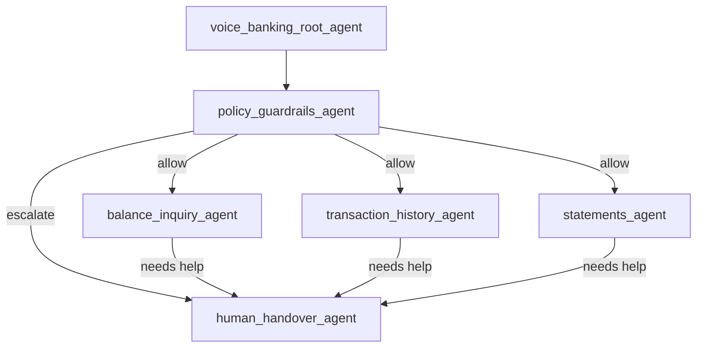
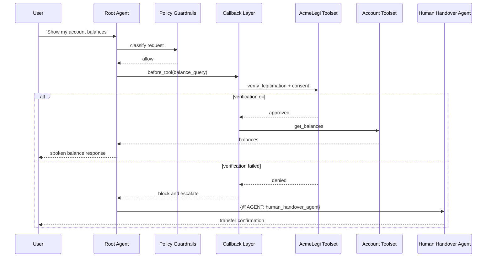

# Banking Use Case Mapping for CX Agent Studio

Author: Codex
Date: 2026-02-07
Status: Solution mapping

## 1) Goal
Map CX Agent Studio primitives to the Voice Banking App requirements, with emphasis on policy controls, human handover, consent verification, legitimation, and auditability.

Primary banking references:
- `docs/implementation-plan/AGENT-001-policy-guardrails.md`
- `docs/implementation-plan/AGENT-002-human-handover.md`
- `docs/functional-requirements/fr-004-account-balance-inquiry.md`
- `docs/functional-requirements/fr-006-human-handover.md`
- `docs/functional-requirements/fr-007-out-of-scope-refusal.md`

## 2) Concept Mapping
| Voice Banking Requirement | CX Agent Studio Concept | Implementation Pattern |
|---|---|---|
| PolicyGuardrailsAgent | Guardrails + before-model/tool callbacks + dedicated policy agent | Classify intent risk, block/redirect, log decision |
| HumanHandoverAgent | Child agent + deterministic `{@AGENT: ...}` transfer + handoff callbacks | Build context payload, route to queue, return status |
| Consent verification | Before-tool callback + consent-check tool | Enforce consent before balance/statement/dispute actions |
| AcmeLegi legitimation checks | OpenAPI toolset + before-tool callback gate | Require valid legitimation token/state before sensitive operations |
| Audit logging | Tool and callback logging hooks + app logging settings | Immutable event model for policy/tool/transfer decisions |

## 3) Target Multi-Agent Banking Topology

Design rule:
- Every sensitive action path passes policy checks before tool execution.

## 4) PolicyGuardrailsAgent in CX Agent Studio
### Agent role
- Single decision gateway for out-of-scope, prohibited, harmful, and escalation conditions.

### Runtime strategy
- Primary classifier in instruction + policy guardrails.
- Deterministic enforcement in callbacks for edge cases.

### Suggested artifact mapping
- Agent file: `agents/policy_guardrails_agent/policy_guardrails_agent.json`
- Instruction file: `agents/policy_guardrails_agent/instruction.txt`
- Guardrails:
  - prompt injection
  - harmful content
  - banned terms
  - policy drift checks

### Callback logic
- `before_model_callback`: block prompt-exfiltration attempts.
- `before_tool_callback`: deny prohibited tools (money movement/advisory/trading in MVP).
- `after_agent_callback`: log policy decisions and refusal categories.

## 5) HumanHandoverAgent in CX Agent Studio
### Agent role
- Handle explicit user request for human support.
- Handle policy-triggered or low-confidence escalations.

### Deterministic transfer pattern
- Root or specialist agent triggers `{@AGENT: human_handover_agent}`.
- Handover agent compiles context and invokes transfer tools.

### Required tools
- `build_handover_context`
- `check_queue_status`
- `route_to_queue`
- `notify_customer_wait_time`
- `log_handover_event`

### Context payload fields
- session ID
- customer ID (masked/hashed as required)
- intent history
- entities
- tool call summary
- policy reason
- recommendation for next human action

## 6) Consent Verification via Callbacks
### Why callbacks
Consent is a hard precondition that must be deterministic and non-bypassable.

### Pattern
- `before_tool_callback` intercepts sensitive tool calls.
- Callback invokes `consent_check` tool (OpenAPI/REST).
- If denied, callback short-circuits with refusal + next action guidance.

### Suggested variable model
- `consent_state`
- `consent_scope`
- `consent_expires_at`
- `consent_reference_id`

## 7) AcmeLegi Integration Pattern
### Toolset approach
Create an OpenAPI toolset for legitimation services:
- `verify_legitimation`
- `get_legitimation_status`
- `refresh_legitimation`

### Enforcement flow
1. Incoming user request classified as sensitive.
2. Before-tool callback checks `consent_state` and legitimation freshness.
3. If stale or missing, call legitimation tool.
4. Continue only on positive legitimation outcome.

## 8) Banking Audit and Compliance Strategy
### Events to log
- policy decisions
- guardrail triggers
- tool calls and arguments (masked)
- handoff triggers and outcomes
- consent and legitimation outcomes

### Required properties
- correlation ID across full turn
- immutable append-only sink
- PII masking at source
- retention aligned with banking policy

### Sample schema categories
- `POLICY_DENY`
- `POLICY_ALLOW`
- `CONSENT_CHECK`
- `LEGITIMATION_CHECK`
- `TOOL_EXECUTION`
- `HUMAN_HANDOVER`

## 9) End-to-End Sensitive Operation Flow

## 10) Delivery Plan for Voice Banking
Phase 1:
- Implement policy gateway agent and minimum refusal matrix.
- Add consent + legitimation callbacks for balance inquiry.

Phase 2:
- Add human handover agent with queue integration.
- Add adversarial and compliance evaluation packs.

Phase 3:
- Extend to statements and transaction history workflows.
- Harden audit schema and compliance dashboards.

## 11) Key Risks and Controls
| Risk | Impact | Control |
|---|---|---|
| Policy bypass via prompt tricks | Regulatory breach | Layered guardrails + deterministic callbacks |
| Missing consent check before tool call | Compliance violation | Mandatory before-tool gating for sensitive tools |
| Incomplete handover context | Poor customer experience | Required payload contract + eval tests |
| Over-logging PII | Security/privacy incident | Masking rules in callback/tool logging layer |

## References
- https://docs.cloud.google.com/customer-engagement-ai/conversational-agents/ps/handoff
- https://docs.cloud.google.com/customer-engagement-ai/conversational-agents/ps/callback
- https://docs.cloud.google.com/customer-engagement-ai/conversational-agents/ps/guardrail
- https://docs.cloud.google.com/customer-engagement-ai/conversational-agents/ps/tool
