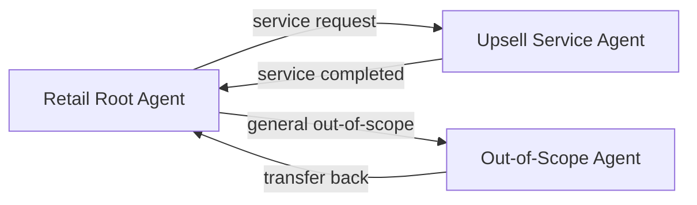

# CX Agent Studio Developer Guide

Author: Codex
Date: 2026-02-07
Status: Practical implementation guide
Modified by Codex on 2026-02-07 to add deployment and compliance guidance.
Modified by  on 2026-02-07 to add best-practice code examples, tool patterns, and development workflow guidance.

## 1) Goal
This guide explains how to build a production-grade multi-agent app in CX Agent Studio using the sample artifact model and reusable patterns.

## 2) Project Skeleton
Start with an export-compatible structure:
- `app.json`
- `environment.json`
- `global_instruction.txt`
- `agents/<agent_name>/<agent_name>.json`
- `agents/<agent_name>/instruction.txt`
- `tools/<tool_name>/<tool_name>.json`
- `tools/<tool_name>/python_function/python_code.py`
- `toolsets/<toolset_name>/<toolset_name>.json`
- `toolsets/<toolset_name>/open_api_toolset/open_api_schema.yaml`
- `guardrails/<guardrail_name>/<guardrail_name>.json`
- `evaluations/<eval_name>/<eval_name>.json`

Reference implementation:
- `sample/Sample_app_2026-02-07-162736/`

## 3) Step-by-Step: First Agent
### Step 1: Define app-level shell
In `app.json`, configure:
- `rootAgent`
- `modelSettings`
- `guardrails`
- `variableDeclarations`
- `languageSettings`
- `evaluationMetricsThresholds`

### Step 2: Declare variables early
Add all session/state contracts in `variableDeclarations` before writing callbacks.
Typical types:
- Domain context object (`customer_profile`)
- Workflow flags (`manager_approved`)
- Runtime control flags (`request_image_tool_called`, inactivity counters)
- Channel metadata (telephony IDs, headers)

### Step 3: Create agent config
For `agents/<name>/<name>.json` set:
- `displayName`
- `description`
- `instruction`
- `tools`
- `childAgents` if multi-agent
- callback arrays as needed

### Step 4: Write structured instruction
Use sections in this order:
- `<role>`
- `<persona>`
- `<constraints>`
- `<taskflow>`
- `<examples>`

Inside `<taskflow>`, define:
- deterministic triggers
- explicit actions
- explicit transfer points via `{@AGENT: ...}`
- explicit tool calls via `{@TOOL: ...}`

### Step 5: Attach tools and toolsets
Use direct tools for deterministic local actions and OpenAPI toolsets for service integration.

Pattern from sample:
- Keep business API operations inside an OpenAPI toolset.
- Keep orchestration glue and deterministic branching in Python tools.

### Step 6: Add callbacks for control and safety
Use callbacks to enforce behaviors the model may miss:
- `before_model_callback`: prompt-injection checks and session inactivity enforcement.
- `after_model_callback`: enforce required tool call if model output omits it.
- `before_tool_callback`: policy validation (discount approval path).
- `after_tool_callback`: update state flags and post-tool bookkeeping.
- `after_agent_callback`: aggregate session signals.

### Step 7: Add guardrails
Layer guardrails by purpose:
- Model safety categories.
- Prompt-injection defense response.
- Content filter policy.
- LLM policy for abnormal agent behavior.

### Step 8: Create evaluations
Create both:
- Golden transcript tests for strict expected behavior.
- Scenario tests for task outcomes with optional mock tool responses.

## 4) Writing Effective Instructions
Guidelines grounded in sample and official best practices:
- Keep role and scope crisp.
- Encode out-of-scope behavior as deterministic handoff rules.
- For sensitive operations, force explicit confirmation and exact tool arguments.
- Keep responses concise for voice channels.
- Avoid hidden assumptions; state transfer and termination rules directly.

Anti-patterns:
- Vague constraints without trigger conditions.
- Multiple behaviors in one step.
- Implicit handoff language without `{@AGENT: ...}`.

## 5) Multi-Agent Orchestration Blueprint


Implementation checklist:
- Define child agents in parent `childAgents`.
- Add explicit transfer rule in parent instruction.
- Add contextual handoff instruction in child: no re-greeting, continue last user intent.
- Add return transfer rule where needed.

## 6) Tool + Callback Integration Pattern
Recommended sequence:
1. Agent determines intent and target tool.
2. `before_tool_callback` validates policy and blocks if needed.
3. Tool executes deterministic logic or API call.
4. `after_tool_callback` mutates session variables and logs control flags.
5. Agent confirms outcome to user.

Use this when business rules require strict gating.

## 7) Best Practices for Tools (Official Guidance)

### 7.1 Wrap APIs with Python Tools

External API schemas often define many input/output parameters irrelevant to your agent. Passing the full schema adds unnecessary tokens to conversation history and can confuse the model.

**Pattern:** Use Python tools to wrap API calls, controlling exactly what context the agent sees. This is a form of **Context Engineering** with tools.

```python
def python_wrapper(arg_a: str, arg_b: str) -> dict:
  """
  Call the scheduling service to schedule an appointment,
  returning only relevant fields.
  """
  res = complicated_external_api_call(...)
  # Process result to extract only relevant key-value pairs.
  processed_res = {
      "appointment_time": res.json()["appointment_time"],
      "appointment_location": res.json()["appointment_location"],
      "confirmation_id": res.json()["confirmation_id"],
  }
  return processed_res
```

**Banking example:** When calling the BFA balance service that returns 20+ fields, wrap it to return only `balance`, `currency`, and `accountType`.

### 7.2 Tool Chaining: Good vs Bad Patterns

When multiple tools must execute in sequence during a single turn, how you structure them matters significantly.

#### ❌ Bad Pattern: Multiple Sequential Tool Calls via Instructions

Instructing the agent to call `tool_1` → `tool_2` → `tool_3` in sequence requires:
- 4 model calls, 3 tool predictions, 4+ input arguments.
- The model must predict every tool call, every parameter, and the correct order.
- You are relying heavily on the model (inherently non-deterministic) for a deterministic task.

```
User Input
  → Model predicts tool_1(arg_a, arg_b)
  → tool_1_response returned
  → Agent interprets response, extracts arg_c
  → Model predicts tool_2(arg_c)
  → tool_2_response returned
  → Agent interprets response, extracts arg_d
  → Model predicts tool_3(arg_d)
  → tool_3_response returned
  → Model provides final response
```

**Result:** 4 model calls, high token usage, risk of hallucinated parameters.

#### ✅ Good Pattern: Single Wrapper Tool

Implement one tool that calls the others internally:

```python
def python_wrapper(arg_a: str, arg_b: str) -> dict:
  """Makes some sequential API calls."""
  res1 = tools.tool_1({"arg_a": arg_a, "arg_b": arg_b})
  res2 = tools.tool_2(res1.json())
  res3 = tools.tool_3(res2.json())

  return res3.json()
```

```
User Input
  → Model predicts python_wrapper(arg_a, arg_b)
  → python_wrapper_response returned
  → Model provides final response
```

**Result:** 2 model calls, minimal tokens, deterministic execution.

**Alternative:** Use `after_tool_callback` to chain the remaining calls after the first tool completes.

**Banking example:** For a balance inquiry that requires legitimation check → consent check → balance fetch, use a single `get_verified_balance` wrapper tool rather than three sequential model-orchestrated calls.

### 7.3 Clear and Distinct Tool Definitions

Best practices for tool definitions:
- Different tools should have **noticeably distinct names** (avoid similar names).
- Remove unused tools from the agent node.
- Use **snake_case** for parameter names with descriptive names.
  - ✅ Good: `first_name`, `phone_number`, `account_id`
  - ❌ Bad: `i`, `arg1`, `fn`, `pnum`, `rqst`
- Use **flattened structures** for parameters, not nested objects. The more nested, the more the model must predict key/value pairs and their types.

### 7.4 Use Tools and Callbacks for Deterministic Behavior

- **Callbacks** provide **full deterministic control** — they execute outside the agent's purview.
- **Tool internals** are deterministic, but **tool call orchestration** by the agent is not — the agent decides *when* to call, *what arguments* to pass, and *how to interpret* results.
- For critical business logic, prefer callbacks over instruction-based tool orchestration.

## 8) Testing and Evaluation Workflow
Minimal workflow:
1. Run smoke chats in simulator.
2. Run golden evaluations for deterministic steps.
3. Run scenario evaluations with mock tool responses.
4. Add adversarial tests (prompt injection, policy bypass, off-topic).
5. Tune instruction and callbacks, then re-run evaluations.

Quality gates:
- Transfer correctness.
- Tool invocation correctness.
- Tool parameter correctness.
- Safety guardrail trigger behavior.

### 8.1 Use Evaluations Systematically

Evaluations keep agents reliable. Use them to set expectations on agent behavior and the APIs called by agents.

Minimum evaluation coverage:
- **Happy path:** Core use cases execute correctly.
- **Tool correctness:** Right tool called with right arguments.
- **Transfer correctness:** Handoffs trigger at correct conditions.
- **Safety:** Prompt injection, off-topic, and policy bypass attempts are blocked.
- **Edge cases:** Empty inputs, malformed requests, service errors.

## 9) Development Workflow Best Practices (Official Guidance)

### 9.1 Define a Collaboration Process

When collaborating with a team:
- **Third-party version control:** Use import/export to synchronize with your VCS. Define clear owners and review steps (require evaluation results before accepting changes).
- **Built-in version control:** Use snapshots for versioning milestones.

### 9.2 Use Versions to Save Agent State

Versions are immutable snapshots of your agent application state.
- Create versions **after every 10-15 major changes**.
- Use semantic naming: `pre-prod-instruction-changes`, `prod-ready-for-testing`, or semver (`v1.0.0`, `v1.0.1`).
- Include meaningful descriptions (like commit messages).
- You can always roll back to any saved version.

### 9.3 Perform End-to-End Testing

Your development process should include E2E testing to verify integrations with external systems — not just unit-level evaluations.

## 10) Deployment and Environment Strategy
Use `environment.json` for environment-specific overrides:
- OpenAPI base URLs.
- Logging sinks (GCS bucket, BigQuery project).

Keep artifact package immutable per release and only vary environment file values across dev/stage/prod.

Deployment surfaces to plan for early:
| Channel | When to use | Key implementation concern |
|---|---|---|
| API access | Server-orchestrated runtime | Handle `generateChatToken` and `runSession` in trusted backend tier |
| Web widget | Browser embedding | Configure JS origins, auth flow, and cross-origin policies |
| Google telephony platform | Telephony-first deployments | Coordinate DID and termination URI provisioning |
| Twilio/Five9/Google Cloud CCAAS | Existing contact center stack | Validate adapter/routing setup and SIP/channel prerequisites |

Channel readiness checklist:
- Create and freeze versioned app artifacts before deployment.
- Validate environment overrides against channel endpoints.
- Run channel-specific smoke tests before production cutover.

## 11) Security and Compliance Hardening
Mandatory controls:
- Enable audit logging on `dialogflow.googleapis.com` and validate log retention policy.
- Define CMEK key strategy (region alignment, lifecycle ownership, rotation policy).
- Mask sensitive data in callback/tool logs.
- Restrict tool invocation permissions for sensitive operations.

Operational caveats:
- Revoked or disabled CMEK keys can stop runtime access.
- Audit logging without retention/search workflows provides weak incident evidence.

## 12) Production Readiness Checklist
- Variables fully typed with safe defaults.
- Guardrails enabled with explicit user-safe responses.
- Callback code idempotent and side-effect safe.
- Handoff map documented and test-covered.
- Evaluation suite includes in-scope, out-of-scope, and adversarial coverage.
- Export package versioned and traceable.
- Deployment channel smoke tests passed (API/web/telephony/contact center).
- Conversation history review process defined for post-release triage.

## 13) References
- Design patterns with code examples (curated from live best-practices/runtime docs): `docs/architecture/cx-agent-studio/design-patterns.md`
- https://docs.cloud.google.com/customer-engagement-ai/conversational-agents/ps/best-practices
- https://docs.cloud.google.com/customer-engagement-ai/conversational-agents/ps/callback
- https://docs.cloud.google.com/customer-engagement-ai/conversational-agents/ps/tool
- https://docs.cloud.google.com/customer-engagement-ai/conversational-agents/ps/evaluation-batch-upload
- https://docs.cloud.google.com/customer-engagement-ai/conversational-agents/ps/deploy
- https://docs.cloud.google.com/customer-engagement-ai/conversational-agents/ps/deploy/api-access
- https://docs.cloud.google.com/customer-engagement-ai/conversational-agents/ps/deploy/web-widget
- https://docs.cloud.google.com/customer-engagement-ai/conversational-agents/ps/deploy/google-telephony-platform
- https://docs.cloud.google.com/customer-engagement-ai/conversational-agents/ps/deploy/twilio
- https://docs.cloud.google.com/customer-engagement-ai/conversational-agents/ps/deploy/five9
- https://docs.cloud.google.com/customer-engagement-ai/conversational-agents/ps/deploy/ccaas
- https://docs.cloud.google.com/customer-engagement-ai/conversational-agents/ps/cmek
- https://docs.cloud.google.com/customer-engagement-ai/conversational-agents/ps/audit-logging
- https://docs.cloud.google.com/customer-engagement-ai/conversational-agents/ps/conversation-history
