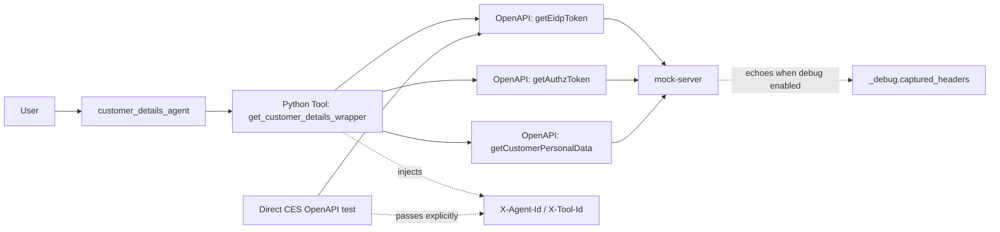
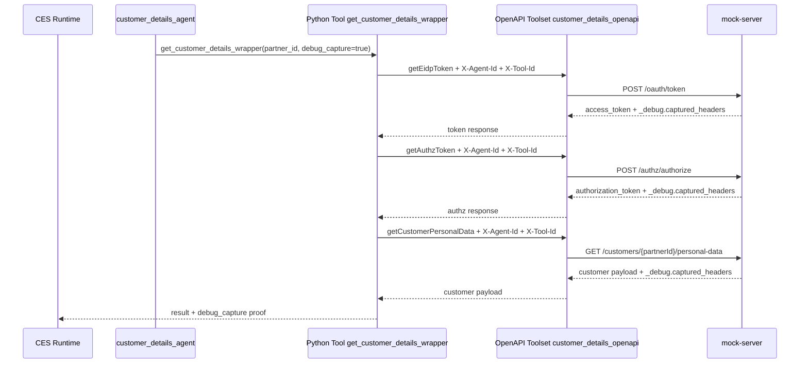

# Header Attribution Thin Wrapper POC

Author: Codex
Date: 2026-03-28
Status: Deployed and verified in `voice-banking-poc/us/acme-voice-us`

## Purpose

This document captures the deployed proof of concept for propagating backend attribution headers from CX Agent Studio to downstream services.

The POC answers one concrete question:

Can we reliably attach a subagent identifier and a tool or OpenAPI method identifier to backend requests made from CES?

The answer is yes, with an important nuance:

- Python tools can inject these headers deterministically in code.
- OpenAPI methods can carry these headers when they are modeled as OpenAPI header parameters and explicitly passed by the caller.
- The current POC does **not** prove that CES automatically injects arbitrary custom attribution headers for OpenAPI calls by configuration alone.

## Official Baseline

The official Google documentation establishes the following:

- Python code tools can implement custom logic, connect to proprietary APIs or databases, and ensure deterministic outcomes.
- Python tools can call other tools defined in the same agent application, including OpenAPI-backed tools.
- OpenAPI tools can define request headers as normal OpenAPI parameters.
- OpenAPI tools support `x-ces-session-context` for deterministic injection of session context values, but that is a specific documented mechanism and not a general custom-header injector.

Official references:

- [Python code tools](https://docs.cloud.google.com/customer-engagement-ai/conversational-agents/ps/tool/python)
- [OpenAPI tools](https://docs.cloud.google.com/customer-engagement-ai/conversational-agents/ps/tool/open-api)
- [Python runtime reference](https://docs.cloud.google.com/customer-engagement-ai/conversational-agents/ps/reference/python)

Relevant excerpts from the official docs:

- Python code tools can "connect to proprietary APIs or databases" and provide deterministic behavior.
- Python tools can call another tool using the `tools.<tool_name>_<endpoint_name>({...})` pattern.
- OpenAPI tools accept header parameters in the schema and support `x-ces-session-context` for session-derived values.

This POC therefore uses the most conservative documented design:

- OpenAPI header parameters for backend identity fields
- a thin Python wrapper where deterministic injection is required

## Problem Statement

For backend observability, debugging, and future policy enforcement, the downstream service should know:

- which CES subagent invoked it
- which tool or OpenAPI operation triggered the request

The required headers are:

- `X-Agent-Id`
- `X-Tool-Id`

For proof-only capture in the mock environment, the POC also uses:

- `X-Debug-Echo-Headers`

## POC Decision

Use a thin Python wrapper for deterministic backend attribution.

In this repo, the deployed example is:

- subagent: `customer_details_agent`
- wrapper tool: `get_customer_details_wrapper`
- toolset: `customer_details_openapi`
- OpenAPI method used for direct proof: `getEidpToken`

The wrapper injects `X-Agent-Id` and `X-Tool-Id` on every downstream toolset call. The mock backend echoes the captured values back in the response body when `X-Debug-Echo-Headers=true` is present.

## What "Thin Wrapper" Means Here

A thin wrapper is a small Python tool that does only four things:

1. validates a minimal input contract
2. sets fixed backend attribution headers
3. calls one or more OpenAPI-backed methods deterministically
4. reshapes the result into an agent-friendly payload

It does **not** own business policy, complex branching, or domain logic.

## Architecture



## Sequence Diagram



## Implementation Mapping

| Concern | Implementation |
|---|---|
| Python wrapper header injection | `acme_voice_agent/tools/get_customer_details/python_function/python_code.py` |
| OpenAPI header contract | `acme_voice_agent/toolsets/customer_details/open_api_toolset/open_api_schema.yaml` |
| Repo-level environment contract | `acme_voice_agent/environment.json` |
| Backend header echo for proof | `java/mock-server/src/main/java/com/acme/banking/demoaccount/HeaderCaptureResponseTransformer.java` |
| Remote proof suite | `test-harness/smoke/suites/ces/customer-details-header-capture-smoke-suite.json` |

### Python wrapper path

The Python wrapper sets:

- `X-Agent-Id=customer_details_agent`
- `X-Tool-Id=get_customer_details_wrapper`

It applies those headers to:

- `getEidpToken`
- `getAuthzToken`
- `getCustomerPersonalData`

Code reference:

- `acme_voice_agent/tools/get_customer_details/python_function/python_code.py`

### Direct OpenAPI path

The OpenAPI schema exposes the headers as normal parameters:

- `X-Agent-Id`
- `X-Tool-Id`
- `X-Debug-Echo-Headers`

That means the caller can pass them directly when invoking the toolset method.

Code reference:

- `acme_voice_agent/toolsets/customer_details/open_api_toolset/open_api_schema.yaml`

## Environment Contract

The repo-level CES environment file documents the header names under `requestContextHeaders`:

- `agentIdHeader: X-Agent-Id`
- `toolIdHeader: X-Tool-Id`
- `debugEchoHeader: X-Debug-Echo-Headers`

Important: this is currently a **contract/documentation layer**, not proof of automatic CES runtime injection for arbitrary OpenAPI headers.

Reference:

- `acme_voice_agent/environment.json`

## Deployed Scope

The verified deployment used:

- project: `voice-banking-poc`
- location: `us`
- app id: `acme-voice-us`
- backend: `mock-server`

Validated deployed resources:

- toolset `customer_details_openapi`
- tool `get_customer_details_wrapper`
- subagent `customer_details_agent`

## Test Strategy

### Recommended automated proof

Run the CES smoke suite:

```bash
cd /Users/constantinaldea/IdeaProjects/ai-account-balance/ces-agent/test-harness/smoke
python3 ces-runtime-smoke.py run-suite \
  --suite /Users/constantinaldea/IdeaProjects/ai-account-balance/ces-agent/test-harness/smoke/suites/ces/customer-details-header-capture-smoke-suite.json
```

This validates:

1. the OpenAPI schema exposes the header parameters
2. the Python wrapper transmits the headers
3. the direct OpenAPI method transmits the headers

### Manual Python-tool check

In CES Studio, test:

- tool: `get_customer_details_wrapper`
- args:
  - `partner_id=1234567890`
  - `debug_capture=true`

Expected proof location:

- `response.result.debug_capture`

### Manual OpenAPI-method check

Use the CES runtime API path:

```bash
cd /Users/constantinaldea/IdeaProjects/ai-account-balance/ces-agent/test-harness/smoke
python3 ces-runtime-smoke.py execute-toolset \
  --project "$GCP_PROJECT_ID" \
  --location "$GCP_LOCATION" \
  --app-id "$CES_APP_ID" \
  --toolset-display-name customer_details_openapi \
  --tool-id getEidpToken \
  --arg X-API-Key="$CUSTOMER_DETAILS_API_KEY" \
  --arg X-Agent-Id=customer_details_agent \
  --arg X-Tool-Id=getEidpToken \
  --arg X-Debug-Echo-Headers=true \
  --arg grant_type=client_credentials \
  --arg client_id=ces-agent-service \
  --arg client_secret=mock-secret
```

Expected proof location:

- `response._debug.captured_headers`

## Proof Artifacts

Successful proof run:

- suite summary: `ces-agent/test-harness/smoke/.artifacts/20260328T083310Z/summary.json`
- Python tool proof: `ces-agent/test-harness/smoke/.artifacts/20260328T083310Z/02-customer_details_python_tool_header_capture.json`
- OpenAPI proof: `ces-agent/test-harness/smoke/.artifacts/20260328T083310Z/03-customer_details_openapi_method_header_capture.json`

Observed values:

### Python tool path

- `x_agent_id = customer_details_agent`
- `x_tool_id = get_customer_details_wrapper`

### Direct OpenAPI path

- `x_agent_id = customer_details_agent`
- `x_tool_id = getEidpToken`

## Limitations

This POC intentionally avoids claiming behavior that has not been proven.

### Proven

- Python tools can deterministically inject custom headers.
- OpenAPI methods can carry custom headers when modeled in the schema and passed explicitly.
- The backend can capture and return these headers for proof.

### Not proven

- automatic CES runtime injection of arbitrary custom attribution headers for all OpenAPI calls from `environment.json` alone

## Recommendation

For production banking flows that require deterministic backend attribution:

- prefer thin Python wrappers around backend-critical OpenAPI calls
- keep the wrapper logic small and auditable
- use explicit OpenAPI header parameters for direct testing and diagnostics
- do not rely on prompt instructions alone to supply backend attribution headers

## Internal References

- `acme_voice_agent/tools/get_customer_details/python_function/python_code.py`
- `acme_voice_agent/toolsets/customer_details/open_api_toolset/open_api_schema.yaml`
- `acme_voice_agent/environment.json`
- `java/mock-server/src/main/java/com/acme/banking/demoaccount/HeaderCaptureResponseTransformer.java`
- `test-harness/smoke/suites/ces/customer-details-header-capture-smoke-suite.json`
- `test-harness/smoke/ces-runtime-smoke.py`

## External References

- [Python code tools](https://docs.cloud.google.com/customer-engagement-ai/conversational-agents/ps/tool/python)
- [OpenAPI tools](https://docs.cloud.google.com/customer-engagement-ai/conversational-agents/ps/tool/open-api)
- [Python runtime reference](https://docs.cloud.google.com/customer-engagement-ai/conversational-agents/ps/reference/python)
