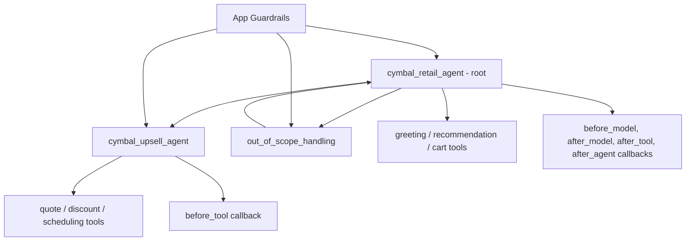

# Sample Analysis: Cymbal Home & Garden

Author: Codex
Date: 2026-02-07
Status: Deep-dive analysis

## 1) Sample Overview
Analyzed package:
- `sample/Sample_app_2026-02-07-162736/`

This sample demonstrates:
- Root retail agent with two specialist child agents.
- Deterministic handoffs and return flow.
- Tool + toolset integration (Python + OpenAPI + Search).
- Runtime callbacks for policy control.
- Multiple guardrail types.
- Golden and scenario evaluation assets.

## 2) Architecture: Agent Hierarchy and Handoffs

Evidence:
- Root agent in `app.json` as `cymbal_retail_agent`.
- Child agents in `cymbal_retail_agent.json`.
- Handoff directives in retail instruction using `{@AGENT: ...}` syntax.

## 3) Retail Agent Analysis
Files:
- `sample/Sample_app_2026-02-07-162736/agents/cymbal_retail_agent/cymbal_retail_agent.json`
- `sample/Sample_app_2026-02-07-162736/agents/cymbal_retail_agent/instruction.txt`

Observed behavior patterns:
- Forced first-turn greeting tool call.
- Strict in-scope boundaries for plant identification/recommendation/cart modifications.
- Silent transfer to upsell agent for service inquiries.
- Transfer to out-of-scope agent for non-core requests.
- Session lifecycle actions via `end_session` tool with structured reasons.

Tooling model:
- Direct tools for flow actions.
- OpenAPI toolset for CRM operations.
- Search tool for plant lookup.

## 4) Upsell Agent Analysis
Files:
- `sample/Sample_app_2026-02-07-162736/agents/cymbal_upsell_agent/cymbal_upsell_agent.json`
- `sample/Sample_app_2026-02-07-162736/agents/cymbal_upsell_agent/instruction.txt`

Key traits:
- Handoff-aware persona: continue context, no re-greeting.
- Narrow scope: quotes, discounts, scheduling, CRM logging.
- Uses `before_tool_callback` to enforce discount policy gates.

Discount policy pattern:
- If discount percentage exceeds threshold without manager approval, callback blocks direct approval path and redirects process.
- Manager-approval variable mediates access to discount application.

## 5) Out-of-Scope Agent Analysis
Files:
- `sample/Sample_app_2026-02-07-162736/agents/out_of_scope_handling/out_of_scope_handling.json`
- `sample/Sample_app_2026-02-07-162736/agents/out_of_scope_handling/instruction.txt`

Pattern:
- Educational fallback response describing platform capabilities.
- Deterministic transfer back to main retail agent.
- Demonstrates explicit transfer-and-return orchestration.

## 6) Callback Examples and Runtime Control
### Retail before-model callback
File: `sample/Sample_app_2026-02-07-162736/agents/cymbal_retail_agent/before_model_callbacks/before_model_callbacks_01/python_code.py`

Purpose:
- Blocks prompt-injection string patterns.
- Enforces inactivity timeout behavior by issuing `end_session` call after counter threshold.

### Retail after-model callback
File: `sample/Sample_app_2026-02-07-162736/agents/cymbal_retail_agent/after_model_callbacks/after_model_callbacks_01/python_code.py`

Purpose:
- Detects when model says "upload" but forgets tool call.
- Injects deterministic `request_image_upload` function call.

### Retail after-tool callback
File: `sample/Sample_app_2026-02-07-162736/agents/cymbal_retail_agent/after_tool_callbacks/after_tool_callbacks_01/python_code.py`

Purpose:
- Updates `request_image_tool_called` state.
- Captures session-end context for debugging or downstream handling.

### Upsell before-tool callback
File: `sample/Sample_app_2026-02-07-162736/agents/cymbal_upsell_agent/before_tool_callbacks/before_tool_callbacks_01/python_code.py`

Purpose:
- Enforces discount approval workflow before discount application.

## 7) Guardrail Strategy in Sample
Files:
- `guardrails/Safety_Guardrail_1757021079744/...`
- `guardrails/Prompt_Guardrail_1757021081696/...`
- `guardrails/bad_words/...`
- `guardrails/French_Fries_Policy/...`

Layered strategy:
- Harm-category safety model thresholds.
- Prompt-injection immediate response.
- Banned-word content block response.
- Policy LLM check for abnormal persona drift and off-pattern responses.

## 8) Toolset Integration
Toolset:
- `sample/Sample_app_2026-02-07-162736/toolsets/crm_service/crm_service.json`
- `sample/Sample_app_2026-02-07-162736/toolsets/crm_service/open_api_toolset/open_api_schema.yaml`

Integration patterns:
- OpenAPI operation IDs become callable tools.
- Runtime endpoint URL supplied by `environment.json`.
- Service-agent ID token auth configuration present in toolset config.

## 9) Evaluation Assets and Test Design
Folder:
- `sample/Sample_app_2026-02-07-162736/evaluations/`

Patterns observed:
- Golden transcript tests with strict expected transfers/tool calls/agent responses.
- Scenario tests with task goals and mock tool responses.
- Adversarial evaluations for prompt injection, off-topic requests, and content policy.

Examples:
- Prompt injection resistance.
- Out-of-scope transfer and return.
- Cart update and recommendation workflows.
- Bad-word filtering behavior.

## 10) Key Reusable Patterns Identified
- Deterministic first-turn initialization via tool call.
- Domain-scoped root agent plus specialist child agents.
- Callback-driven enforcement when model output is insufficiently deterministic.
- Guardrail layering for safety, policy, and content boundaries.
- Evaluation assets as release-quality contracts.

## 11) What To Reuse For Banking
Directly reusable patterns:
- Specialized service-agent handoff model.
- Callback gating for high-risk operations.
- Toolset-backed API operations with environment override.
- Evaluation style for compliance and adversarial cases.

## References
- https://docs.cloud.google.com/customer-engagement-ai/conversational-agents/ps/handoff
- https://docs.cloud.google.com/customer-engagement-ai/conversational-agents/ps/callback
- https://docs.cloud.google.com/customer-engagement-ai/conversational-agents/ps/guardrail
