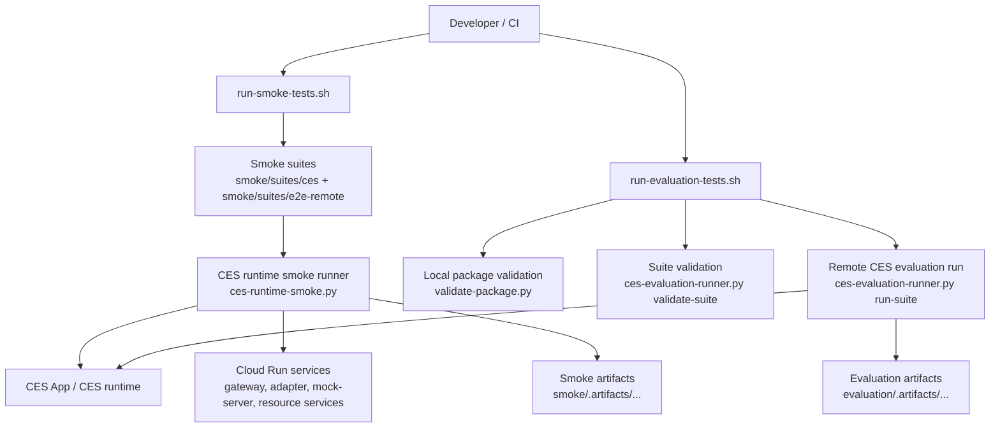
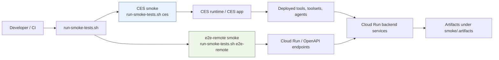

# CES Test Harness

`ces-agent/test-harness/` is the shared home for the repository's developer-run
quality checks.

It provides two complementary test frameworks:

- **Smoke tests** via `./run-smoke-tests.sh`
- **Evaluation tests** via `./run-evaluation-tests.sh`

They are related, but they answer different questions.

## What each framework is for

| Framework | Primary question | Validation level | Typical failures it catches |
|---|---|---|---|
| **Smoke tests** | **Does the deployed system work and connect correctly?** | Runtime wiring and operational connectivity | Missing tools/toolsets, broken remote HTTP/OpenAPI paths, Cloud Run reachability issues, gateway/adapter/resource integration failures, CES runtime integration regressions |
| **Evaluation tests** | **Does the deployed CES agent behave correctly and meet quality thresholds?** | Conversational and behavioral quality through CES evaluations | Wrong routing, degraded specialist-agent behavior, poor scenario quality, low pass rates, missing evaluation outputs/artifacts |

### Smoke tests

Smoke tests validate deployed runtime wiring and operational connectivity,
including:

- tool and toolset availability in the CES runtime
- remote HTTP/OpenAPI paths
- Cloud Run service reachability
- gateway/adapter/resource integration
- CES runtime integration paths

Use smoke tests when you want to prove that the deployed stack is reachable,
wired correctly, and operational.

### Evaluation tests

Evaluation tests validate conversational and behavioral quality through CES
evaluations, including:

- routing correctness
- specialist-agent behavior
- scenario quality
- pass-rate thresholds
- evaluation-run artifacts and summaries

Use evaluation tests when you want to prove that the deployed CES agent behaves
well enough, not just that the plumbing is reachable.

## How the two frameworks fit together

The two frameworks are **complementary, not interchangeable**:

- Run **smoke tests** to verify runtime wiring after deployment or backend
  changes.
- Run **evaluation tests** to verify agent quality after prompt, routing,
  tool-selection, or evaluation changes.

Typical workflow:

1. Deploy or update Cloud Run services / CES resources.
2. Run **smoke tests** to confirm the runtime is healthy and connected.
3. Run **evaluation tests** to confirm the CES agent still meets quality goals.

## Architecture overview



## Layout

```text
ces-agent/test-harness/
├── README.md
├── run-smoke-tests.sh
├── run-evaluation-tests.sh
├── run-langsmith-experiments.sh
├── smoke/
│   ├── README.md
│   ├── ces-runtime-smoke.py
│   ├── suites/
│   └── tests/
└── evaluation/
    ├── README.md
    ├── ces-evaluation-runner.py
    ├── langsmith-live-experiments.py
    ├── suites/
    └── tests/
```

Voice-input experimentation is intentionally kept outside this shared harness in
`ces-agent/voice-testing/` so audio/transcript experiments can evolve
independently of the text-first CES runtime and evaluation framework.

## Smoke test commands

Smoke tests are the operational/runtime layer.

Successful and failing smoke runs write per-run artifacts under
`smoke/.artifacts/`.

Within smoke testing, there are **two different paths**:

- **CES smoke** = test the deployed system **through the CES runtime**
- **e2e-remote** = test the deployed backend services **directly, without going
  through CES**

| Command | What it runs | Remote or local? | What it touches | Use it when |
|---|---|---|---|---|
| `./run-smoke-tests.sh all` | All CES smoke suites, all `e2e-remote` smoke suites, and smoke framework unit tests | **Remote + local** | CES runtime plus direct Cloud Run/OpenAPI endpoints | You want full runtime coverage after deployment or before handing off a stack |
| `./run-smoke-tests.sh ces` | CES smoke suites under `smoke/suites/ces/` and smoke framework unit tests | **Remote + local** | Deployed CES app/runtime and tool/toolset execution paths | You changed CES resources or want to confirm CES runtime integration specifically |
| `./run-smoke-tests.sh e2e-remote` | `e2e-remote` suites under `smoke/suites/e2e-remote/` and smoke framework unit tests | **Remote + local** | Direct Cloud Run services and raw OpenAPI/HTTP integration paths | You changed backend services, service auth, gateway/adapter wiring, or want to isolate backend issues from CES |

### CES smoke vs `e2e-remote`

| Mode | Test path | What it proves | Typical suite/test types |
|---|---|---|---|
| **CES smoke** | `smoke runner -> CES app/runtime -> deployed tool/toolset -> backend services` | The CES app can see and execute the deployed resources it depends on | `resource_exists`, `execute_tool`, `toolset_schema`, `execute_toolset_tool` |
| **e2e-remote** | `smoke runner -> Cloud Run/OpenAPI endpoint directly` | The backend stack itself is reachable and behaves correctly even outside CES | `openapi_operation`, `http_request` |

In other words:

- **CES smoke** asks: "If CES tries to use this tool or toolset, does it work?"
- **e2e-remote** asks: "If I hit the backend service directly, does it work?"

That distinction matters when debugging:

- If **CES smoke fails but `e2e-remote` passes**, the backend is probably healthy
  and the problem is more likely in CES deployment, CES runtime integration,
  tool/toolset registration, auth propagation inside the CES path, or schema/runtime mapping.
- If **`e2e-remote` fails**, the problem is usually below CES in the Cloud Run /
  gateway / adapter / resource-service layer.

### Smoke path diagram



### Smoke test mode details

#### `./run-smoke-tests.sh all`

- Runs every auto-discovered smoke suite in both:
  - `smoke/suites/ces/`
  - `smoke/suites/e2e-remote/`
- Then runs `smoke/tests/test_ces_runtime_smoke.py`
- Catches broad runtime regressions across both the CES runtime layer and the
  direct backend/service layer

#### `./run-smoke-tests.sh ces`

- Runs only the CES runtime smoke suites
- Verifies things such as:
  - deployed tool and toolset availability
  - CES runtime tool execution
  - CES-to-backend integration paths exposed through deployed CES resources
- Uses suites that declare CES context such as `project`, `location`, and `app_id`
- Representative example: `smoke/suites/ces/customer-details-smoke-suite.json`
  checks that CES can find deployed tools/toolsets and execute the
  `customer_details_openapi` toolset path through the CES runtime
- Best when the question is: "Did my CES deployment wire up correctly?"

#### `./run-smoke-tests.sh e2e-remote`

- Runs only the raw backend/OpenAPI smoke suites
- Verifies things such as:
  - Cloud Run service reachability
  - health endpoints
  - gateway invocation paths
  - adapter/resource integration
  - raw remote HTTP/OpenAPI contract paths
- Uses suites that declare a `services_file` and call service operations directly
- Representative example:
  `smoke/suites/e2e-remote/discovery-plan-e2e-remote-smoke-suite.json`
  calls `mock-server`, `bfa-adapter-branch-finder`, `bfa-gateway`, and
  `bfa-service-resource` endpoints directly
- Best when the question is: "Is the backend stack healthy independent of CES?"

## Evaluation test commands

Evaluation tests are the conversational-quality layer.

| Command | What it runs | Local validation first? | Remote CES evaluations? | Use it when |
|---|---|---|---|---|
| `./run-evaluation-tests.sh all` | Package validation, golden suite validation/run, scenario suite validation/run | **Yes** | **Yes** | You want the main quality regression pass |
| `./run-evaluation-tests.sh golden` | Package validation, golden suite validation/run | **Yes** | **Yes** | You want deterministic regression checks on the core agent journeys |
| `./run-evaluation-tests.sh scenario` | Package validation, scenario suite validation/run | **Yes** | **Yes** | You want broader behavioral and specialist-agent quality coverage |
| `./run-evaluation-tests.sh unit` | Evaluation framework unit tests only | **No remote execution** | **No** | You are changing the harness itself and want a fast local check |

### Evaluation test mode details

#### `./run-evaluation-tests.sh all`

- Runs local CES package validation first
- Validates both suite definitions locally
- Then runs both remote CES evaluation suites:
  - `evaluation/suites/agent-quality-golden-suite.json`
  - `evaluation/suites/agent-quality-scenario-suite.json`
- Generates evaluation artifacts under `evaluation/.artifacts/<timestamp>/`
- Each suite run writes a `summary.json` plus the captured CES run/result payloads

Use this when you want the broadest quality signal for the deployed CES app.

#### `./run-evaluation-tests.sh golden`

- Runs local CES package validation first
- Validates the golden suite definition locally
- Runs the **golden suite** remotely through CES `runEvaluation`
- Writes evaluation artifacts and a final `summary.json` under
  `evaluation/.artifacts/<timestamp>/`

"Golden" means the more deterministic regression suite for core root-agent and
routing behavior. It is intended to catch hard regressions in well-understood,
high-signal flows.

#### `./run-evaluation-tests.sh scenario`

- Runs local CES package validation first
- Validates the scenario suite definition locally
- Runs the **scenario suite** remotely through CES `runEvaluation`
- Writes evaluation artifacts and a final `summary.json` under
  `evaluation/.artifacts/<timestamp>/`

"Scenario" means broader behavioral coverage for more variable or specialist
flows. These tests are still assertions, but they are designed for realistic
conversational quality rather than only the most deterministic regressions.

#### `./run-evaluation-tests.sh unit`

- Runs only `evaluation/tests/test_ces_evaluation_runner.py`
- Does **not** perform package validation
- Does **not** call the remote CES evaluation API
- Produces only local unit-test output

Use this when you are editing the evaluation harness itself.

## What evaluation tests validate before any remote CES call

`./run-evaluation-tests.sh` performs local validation before remote execution.
That is intentional.

### Step 1: CES package structure validation

It first runs the canonical validator for `ces-agent/acme_voice_agent/`.
This checks local package integrity such as:

- `app.json` validity
- root-agent and child-agent references
- global instruction and instruction-file presence
- tool and toolset references
- OpenAPI schema references
- callback/python file references
- evaluation definitions and other package cross-references

### Step 2: Suite-definition validation

It then validates the selected evaluation suite JSON before contacting CES.
This confirms that the suite is structurally valid and that the referenced local
evaluation assets exist.

### Step 3: Remote CES evaluation execution

Only after the local package and suite both validate does the harness start a
remote CES evaluation run, poll for completion, and write run artifacts and a
summary.

This ordering helps catch cheap local errors before spending time on remote CES
evaluation execution.

## Which failures each framework is meant to catch

| Failure type | Smoke tests | Evaluation tests |
|---|---|---|
| Missing or unreachable Cloud Run service | **Yes** | No |
| Broken gateway/adapter/resource HTTP wiring | **Yes** | No |
| Broken CES tool/toolset execution path | **Yes** | Sometimes indirectly, but not the primary purpose |
| Missing deployed CES runtime resource | **Yes** | No |
| Wrong agent routing behavior | Not the primary purpose | **Yes** |
| Specialist-agent quality regression | Not the primary purpose | **Yes** |
| Pass-rate threshold regression | No | **Yes** |
| Missing evaluation artifact / summary expectations | No | **Yes** |
| Local package cross-reference error | No | **Yes**, before remote execution |

## Common command entrypoints

From `ces-agent/test-harness/`:

```bash
./run-smoke-tests.sh all
./run-smoke-tests.sh ces
./run-smoke-tests.sh e2e-remote

./run-evaluation-tests.sh all
./run-evaluation-tests.sh golden
./run-evaluation-tests.sh scenario
./run-evaluation-tests.sh unit

./run-langsmith-experiments.sh validate
./run-langsmith-experiments.sh routing --upload-mode never --app-id acme-voice-eu
```

## Extend the suites

- Add or update smoke suites under `smoke/suites/`
- Add or update evaluation suites under `evaluation/suites/`
- Add runner regressions under the matching `tests/` folder
- Use `smoke/README.md` and `evaluation/README.md` for suite-specific guidance

## Compatibility

Thin compatibility wrappers remain in the legacy `smoke-tests/` and
`evaluation-tests/` folders so older commands can keep forwarding into the new
canonical structure while documentation catches up.
