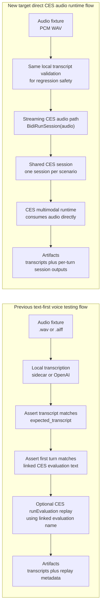

# Voice Testing Sleeve

`ces-agent/voice-testing/` is an isolated sleeve for voice-input evaluation.

It is intentionally separate from:

- `ces-agent/test-harness/evaluation/`, which validates CES conversational quality
- `ces-agent/test-harness/smoke/`, which validates deployed tools and remote paths

The purpose of this sleeve is narrower:

- prove the shape of a voice-driven evaluation workflow
- keep audio fixtures and transcript assertions out of the main text harness
- provide a clean seam for future real STT providers

## What The First Version Does

The initial implementation is a deterministic local harness:

1. load an audio fixture
2. resolve a transcript through a local sidecar file
3. assert the transcript matches the expected utterance
4. optionally assert the transcript matches the first `userInput.text` in a linked CES evaluation

That means the first version is honest and simple:

- it is voice-fixture driven
- it is not yet production STT driven
- it already proves whether a spoken fixture can map cleanly onto an existing CES evaluation input

The sleeve now also supports a real API-backed transcription provider:

- `sidecar`: deterministic transcript from a checked-in text file
- `openai`: live transcription via `POST /v1/audio/transcriptions`

It now also supports an optional remote CES replay step after local
transcription succeeds. That replay path uses the scenario's linked CES
evaluation and stores the resulting remote evaluation run metadata beside the
turn-level transcript artifacts.

It now also supports an optional **direct CES session** step that sends each
WAV fixture turn to CES `BidiRunSession` under one shared session per scenario.
That path exercises the deployed CES multimodal runtime with prerecorded audio,
instead of only replaying a linked text-grounded evaluation.

Remote replay is observational by default: it records the actual CES outcome
without failing the local voice suite. When the deployed services are healthy
again, use `--remote-replay-mode assert` to make remote CES success a gating
requirement.

It also now supports multi-turn scenarios, so a single suite scenario can model
an appointment journey such as:

1. requesting an appointment
2. clarifying the topic
3. selecting a branch
4. choosing a day or slot window
5. confirming the booking

## Flow Comparison

The old harness path and the new direct CES runtime path solve adjacent but
different problems.

- **Previous flow:** proves the audio fixture can be transcribed and mapped back
  to the text contract that the linked CES evaluation expects.
- **New target flow:** proves the deployed CES multimodal runtime can consume
  the prerecorded audio itself through **`BidiRunSession`**, which is the CES
  streaming audio surface.



> **Live validation note (2026-03-29):** the first `--ces-session` prototype
> targeted single-turn `runSession`, and CES returned
> `HTTP 400 ... Input audio config is not supported for RunSession.` The runner
> now uses **`BidiRunSession`**, which is the correct CES streaming audio
> surface for prerecorded voice checks.

### What changed conceptually

| Concern | Previous path | New path |
|---|---|---|
| Primary contract | Transcript matches expected text | CES runtime accepts actual audio |
| CES surface exercised | Optional `runEvaluation` replay | `BidiRunSession` audio stream (target path) |
| Input to CES | Linked evaluation name | Base64-encoded WAV audio |
| Runtime continuity | Independent replay of linked evaluation | One shared CES session across the scenario |
| Best use case | Fixture/transcript regression checks | Multimodal runtime validation |

## Folder Layout

```text
ces-agent/voice-testing/
├── README.md
├── requirements.txt
├── voice-eval-runner.py
├── fixtures/
│   └── appointment-routing-english/
│       ├── utterance.aiff
│       └── utterance.transcript.txt
│   └── appointment-booking-branch-flow/
│       ├── 01-request-branch-booking.wav
│       ├── 01-request-branch-booking.transcript.txt
│       ├── ...
│       ├── 05-confirm-booking.wav
│       └── 05-confirm-booking.transcript.txt
│   └── appointment-booking-branch-flow-german/
│       ├── 01-request-branch-booking.wav
│       ├── 01-request-branch-booking.transcript.txt
│       ├── ...
│       ├── 05-confirm-booking.wav
│       └── 05-confirm-booking.transcript.txt
├── suites/
│   ├── simple-voice-routing-suite.json
│   ├── simple-voice-routing-openai-suite.json
│   ├── multistep-appointment-booking-suite.json
│   ├── multistep-appointment-booking-openai-suite.json
│   ├── multistep-appointment-booking-german-suite.json
│   └── multistep-appointment-booking-german-openai-suite.json
└── tests/
    └── test_voice_eval_runner.py
```

## Example Scenario

The initial scenario uses a real local audio fixture for the utterance:

`I'd like to book an advisory appointment`

and links it to the existing CES evaluation:

[`appointment_routing_english`](/Users/constantinaldea/IdeaProjects/ai-account-balance/ces-agent/acme_voice_agent/evaluations/appointment_routing_english/appointment_routing_english.json)

This lets the sleeve answer a concrete question:

`Does this spoken fixture map cleanly to the exact text already used by the routing evaluation?`

The working live OpenAI suite currently uses:

- [`utterance-openai.wav`](/Users/constantinaldea/IdeaProjects/ai-account-balance/ces-agent/voice-testing/fixtures/appointment-routing-english/utterance-openai.wav)

The new multi-turn appointment-booking fixture pack uses six WAV utterances to
model a branch-booking conversation that aligns to the existing CES scenario
[`appointment_booking_branch_flow`](/Users/constantinaldea/IdeaProjects/ai-account-balance/ces-agent/acme_voice_agent/evaluations/appointment_booking_branch_flow/appointment_booking_branch_flow.json).

The English pack now includes an explicit confirmation turn after topic
selection so the prerecorded dialog matches the live CES behavior of confirming
the requested branch-channel location before asking for a specific branch.

The bilingual extension adds a German fixture pack and a German CES scenario:

- [`appointment_booking_branch_flow_german`](/Users/constantinaldea/IdeaProjects/ai-account-balance/ces-agent/acme_voice_agent/evaluations/appointment_booking_branch_flow_german/appointment_booking_branch_flow_german.json)
- deterministic German voice suite
- live OpenAI-backed German voice suite

The runner validates that:

- each turn transcript matches its expected utterance
- the first turn matches the linked CES evaluation's quoted `Start with ...`
- artifacts capture all turn-level transcripts in one scenario JSON so drift is visible run to run
- optional remote replay captures the linked CES evaluation run, result resources, and conversation identifiers

This fixture was generated through OpenAI text-to-speech because the local macOS
`say` command in this environment produced zero-frame AIFF headers instead of
usable speech audio.

## Commands

All examples below assume you start in the sleeve directory:

```bash
cd /path/to/acme-agentic-voice-app-main/ces-agent/voice-testing
```

### 1) Harness unit tests

This command runs the local unit tests for `voice-eval-runner.py`.

It is important because it gives the fastest signal that the harness still
parses suites correctly, resolves fixtures and linked evaluations, writes
artifacts, and handles remote replay / CES session modes without breaking the
core workflow.

```bash
python3 -m unittest -b tests/test_voice_eval_runner.py
```

### 2) Optional compile check

This command asks Python to compile the runner and test module without executing
the full suite.

It is useful as a very fast syntax check before a larger test run, especially
after editing CLI logic or string formatting.

```bash
python3 -m py_compile voice-eval-runner.py tests/test_voice_eval_runner.py
```

### 3) Install the optional direct-session dependency

This installs the extra dependency needed only for `--ces-session`
(`BidiRunSession`) runs.

You do not need this for deterministic sidecar suites, OpenAI transcription, or
remote replay.

```bash
python3 -m pip install -r requirements.txt
```

### 4) Validate a suite definition

This checks the suite JSON, fixture paths, and linked evaluation references
without running transcription or CES.

It is an important preflight step because it catches broken suite wiring before
you spend time on live STT or remote CES calls.

```bash
python3 voice-eval-runner.py validate-suite \
  --suite ./suites/simple-voice-routing-suite.json
```

### 5) Run the deterministic single-turn suite

This runs the simplest local voice suite using checked-in sidecar transcripts.

Use it first when you want to prove that the fixture, expected transcript, and
linked CES evaluation text are still aligned.

```bash
python3 voice-eval-runner.py run-suite \
  --suite ./suites/simple-voice-routing-suite.json
```

### 6) Run the live OpenAI-backed single-turn suite

This uses the OpenAI transcription path instead of a sidecar transcript.

It is important when you want to verify that the actual audio file still
transcribes correctly, not just that the local sidecar text matches the suite.

```bash
python3 voice-eval-runner.py run-suite \
  --suite ./suites/simple-voice-routing-openai-suite.json
```

### 7) Run the deterministic multi-turn branch-booking suite

This exercises the multi-turn booking flow locally with checked-in sidecar
transcripts.

Use it to verify scenario sequencing and transcript expectations before moving
to live STT or CES integration.

```bash
python3 voice-eval-runner.py run-suite \
  --suite ./suites/multistep-appointment-booking-suite.json
```

### 8) Run the live OpenAI-backed multi-turn branch-booking suite

This runs the same multi-turn booking flow, but with live OpenAI transcription.

Use it after changing the audio fixtures, wording, or prompts to confirm that
the audio itself still produces the expected transcripts end to end.

```bash
python3 voice-eval-runner.py run-suite \
  --suite ./suites/multistep-appointment-booking-openai-suite.json
```

### 9) Run the deterministic German multi-turn suite

This is the local baseline for the German booking flow using sidecar
transcripts.

It is the safest first check before debugging German audio quality or CES
runtime behavior.

```bash
python3 voice-eval-runner.py run-suite \
  --suite ./suites/multistep-appointment-booking-german-suite.json
```

### 10) Run the live OpenAI-backed German multi-turn suite

This verifies the German booking fixtures through live OpenAI transcription.

Use it when you need to know whether the recorded German audio is still usable,
not just whether the suite definition is correct.

```bash
python3 voice-eval-runner.py run-suite \
  --suite ./suites/multistep-appointment-booking-german-openai-suite.json
```

### 11) Run remote CES replay

This replays the linked CES evaluations remotely after the local transcript
checks succeed.

Use it when you want to compare the local voice result with the current deployed
CES behavior and capture the remote evaluation run artifacts beside the local
voice artifacts.

```bash
python3 voice-eval-runner.py run-suite \
  --suite ./suites/multistep-appointment-booking-suite.json \
  --remote-replay
```

### 12) Run the direct CES runtime check (`BidiRunSession`)

This streams the prerecorded WAV turns directly into the deployed CES runtime
instead of replaying a linked text-based evaluation.

It is the most integration-heavy command in this sleeve and is the closest check
to “can CES consume this audio fixture as audio?”.

```bash
python3 voice-eval-runner.py run-suite \
  --suite ./suites/multistep-appointment-booking-suite.json \
  --ces-session \
  --deployment-id YOUR_DEPLOYMENT_ID
```

### 13) Observe direct CES session output without failing the suite

This records the direct CES session result but does not make the suite fail just
because CES session mode failed.

Use it while the deployed stack is still unstable and you want artifacts and
evidence without turning the live CES path into a hard gate.

```bash
python3 voice-eval-runner.py run-suite \
  --suite ./suites/multistep-appointment-booking-suite.json \
  --ces-session \
  --ces-session-mode observe \
  --deployment-id YOUR_DEPLOYMENT_ID
```

### 14) Quick remote replay smoke

This is a fast proof that remote replay starts and records an outcome, without
waiting for a long CES evaluation operation to finish.

Use it as a lightweight connectivity check before running a longer remote replay
assertion.

```bash
python3 voice-eval-runner.py run-suite \
  --suite ./suites/multistep-appointment-booking-suite.json \
  --remote-replay \
  --remote-timeout-seconds 1
```

### 15) Require remote CES replay to pass

This turns remote replay into a gating assertion instead of an observational
artifact.

It is important when the deployed CES path is expected to be healthy and remote
success should block merges or handoff.

```bash
python3 voice-eval-runner.py run-suite \
  --suite ./suites/multistep-appointment-booking-suite.json \
  --remote-replay \
  --remote-replay-mode assert
```

The OpenAI suite requires `OPENAI_API_KEY` and a supported audio format such as
`wav`.

Remote replay requires `gcloud` authentication plus CES deployment coordinates
either from CLI flags or environment variables such as `GCP_PROJECT_ID`,
`GCP_LOCATION`, `CES_APP_ID`, and `CES_ENDPOINT`.

Direct CES session mode also requires a deployment id, supplied either via
`--deployment-id` or `CES_DEPLOYMENT_ID`.

`CES_APP_ID` and `CES_DEPLOYMENT_ID` are **different CES resources**:

- `CES_APP_ID` is the CES app resource id (often a UUID, not a friendly name)
- `CES_DEPLOYMENT_ID` is the API access deployment/channel id created under
  **Deploy → API access** for that app

Use the real API access channel deployment ID from **Deploy → API access**.
The placeholder `api-access-1` used during local prototyping returned CES
`NOT_FOUND` for `acme-voice-us` during live validation on 2026-03-29.

If those values are swapped, the runner now fails fast before opening the
websocket and explains whether the configured app is missing, whether the
deployment id looks like an app id, or whether the app simply has no API access
deployments yet.

The optional websocket dependency used by `--ces-session` is tracked locally in
[`requirements.txt`](/Users/constantinaldea/IdeaProjects/ai-account-balance/ces-agent/voice-testing/requirements.txt)
so the package-level setup stays explicit and reproducible.

For websocket streaming, the runner normalizes regional REST hosts such as
`ces.us.rep.googleapis.com` to the global websocket host `ces.googleapis.com`.
Live validation showed the regional websocket handshake returning `HTTP 503`,
while the global host successfully accepted the streaming connection.

The direct CES session mode currently expects **PCM WAV fixtures** at one of the
documented CES runtime sample rates (`8000`, `16000`, or `24000` Hz). The
current booking fixtures in this repository already satisfy that requirement.

This CLI path is still integration-heavy, but it now uses the correct CES audio
surface: the earlier live check proved that single-turn `runSession` rejects
`inputAudioConfig`, so the runner has been moved to `BidiRunSession`.

Because the deployed advisory appointment services may currently fail inside
CES, the default `observe` mode is useful for capturing the real runtime tool
errors without masking the underlying voice-transcription result. In that mode,
remote tool failures or timeouts are written to the scenario artifact while the
local voice suite can still pass.

The repository root `.env` is the preferred central config source for those CES
values. The current default shape is:

- `GCP_PROJECT_ID=voice-banking-poc`
- `GCP_LOCATION=us`
- `CES_APP_ID=<your-live-ces-app-id>`
- `CES_ENDPOINT=https://ces.us.rep.googleapis.com`
- `CES_DEPLOYMENT_ID=<deploy-api-access-channel-id>`

For service-account-based local auth, prefer one of:

- `GOOGLE_APPLICATION_CREDENTIALS=/absolute/path/to/service-account.json`
- `SA_ACCOUNT_LOCATION=/absolute/path/to/service-account.json`

The runner now normalizes `SA_ACCOUNT_LOCATION` into the standard
`GOOGLE_APPLICATION_CREDENTIALS` and `CLOUDSDK_AUTH_CREDENTIAL_FILE_OVERRIDE`
variables before invoking `gcloud auth print-access-token`, which matches the
token-based prototype flow captured in `api-deoloyment.md`.

For the current shared environment validated on `2026-03-29`, the live app id
was:

- `CES_APP_ID=e88e13e5-14d0-4f87-93cd-0ee92ec318eb`

At that point the app had agents but **no API access deployments**, so
`--ces-session` could not succeed until a deployment/channel was created and
its id was placed into `CES_DEPLOYMENT_ID`.

If the repository root does not already contain a local `.env`, create one with
an `OPENAI_API_KEY` placeholder or export the key in your shell before running
the live suites.

Artifacts are written to:

`ces-agent/voice-testing/.artifacts/<timestamp>/`

## Recommended Test Workflow

For day-to-day work, this order gives the fastest feedback with the least
surprise:

1. **Update the text contract first**
  - adjust the linked CES evaluation JSON when needed
  - update the suite JSON under `suites/`
  - keep `expected_transcript` aligned with the first linked evaluation utterance

2. **Run the harness unit tests**
  - validates parsing, linkage, remote replay mode behavior, and artifact writing

3. **Run the deterministic local suite**
  - uses checked-in transcript sidecars
  - confirms the suite wiring and expected utterances before involving live STT

4. **Run the live OpenAI transcription suite**
  - verifies that the real WAV fixtures still transcribe correctly
  - use this after changing audio fixtures or wording

5. **Run the direct CES `BidiRunSession` check when you need live evidence**
  - useful for confirming current platform behavior against the deployed CES app
  - the earlier prototype showed `runSession` is not the correct audio surface
  - the runner now streams prerecorded audio through `BidiRunSession`

6. **Run remote CES replay in `observe` mode**
  - captures the actual deployed CES/tool outcome in artifacts
  - recommended while backend appointment services are still unstable

7. **Switch to `assert` mode only when the deployed flow is healthy**
  - use `--remote-replay-mode assert` when remote CES success should block the test

### Suggested command sequence

```bash
cd /path/to/acme-agentic-voice-app-main/ces-agent/voice-testing

# 1) Harness regression tests: fast local check that parsing, artifacts,
#    and remote-mode control flow still work before any live integration run.
python3 -m unittest -b tests/test_voice_eval_runner.py

# 2) Deterministic suite: prove the fixture and expected transcript contract
#    are still aligned before involving OpenAI or CES.
python3 voice-eval-runner.py run-suite \
  --suite ./suites/multistep-appointment-booking-suite.json

# 3) Live STT verification: confirm the actual WAV fixtures still transcribe
#    correctly through the live OpenAI path.
python3 voice-eval-runner.py run-suite \
  --suite ./suites/multistep-appointment-booking-openai-suite.json

# 4) Direct CES runtime check: stream the audio into CES itself via
#    BidiRunSession when you need multimodal runtime evidence.
python3 voice-eval-runner.py run-suite \
  --suite ./suites/multistep-appointment-booking-suite.json \
  --ces-session \
  --deployment-id YOUR_DEPLOYMENT_ID

# 5) Remote CES observation: record deployed CES evaluation behavior without
#    making remote success a hard gate yet.
python3 voice-eval-runner.py run-suite \
  --suite ./suites/multistep-appointment-booking-suite.json \
  --remote-replay
```

### Quick remote replay smoke

If you only want to prove that remote replay starts and records an outcome, use
a very short timeout:

```bash
cd /Users/constantinaldea/IdeaProjects/ai-account-balance/ces-agent/voice-testing
python3 voice-eval-runner.py run-suite \
  --suite ./suites/multistep-appointment-booking-suite.json \
  --remote-replay \
  --remote-timeout-seconds 1
```

In `observe` mode that should still leave the suite green while writing the
timeout or remote failure details into the scenario artifact.

## How Text Becomes Audio Fixtures

The current workflow starts from **text**, not from prerecorded speech.

### 1) Write the canonical user text

Each voice turn has two text sources that should agree:

- the suite entry's `expected_transcript`
- the checked-in sidecar transcript file such as
  `fixtures/.../01-request-branch-booking.transcript.txt`

For the first turn, that text should also match the linked CES evaluation's
opening utterance.

### 2) Synthesize audio from the same text

The current fixture packs were generated through OpenAI text-to-speech, because
the local macOS `say` command produced unusable empty-container audio in this
environment.

Conceptually the process is:

1. choose the final utterance text
2. send it to OpenAI TTS
3. save the returned audio next to the transcript sidecar
4. verify the file is a real PCM WAV if the provider response/container is ambiguous

### 3) Normalize to working WAV files

If a provider returns audio with a mismatched extension or an unexpected
container, convert it to PCM WAV before committing it. In this repo we used
`afconvert` on macOS when needed to normalize generated fixtures into working
24 kHz mono WAV files.

### 4) Verify the fixture in two passes

- **deterministic pass**: sidecar transcript proves the suite wiring
- **live STT pass**: OpenAI transcription proves the audio itself is still usable

### 5) Optional remote replay

Once the text and audio are both good, remote replay can send the linked CES
evaluation to the deployed app and record whether the live tool chain succeeds,
times out, or fails.

There is now also a direct CES runtime path for prerecorded WAV fixtures. The
live check in this repository showed that single-turn `runSession` is **not**
the correct CES audio surface because it rejects `inputAudioConfig`, so this
runner now targets `BidiRunSession` instead.

### Practical example

For a new turn like:

- `expected_transcript`: `I want to book an advisory appointment at a branch in Berlin`

you would:

1. put that exact sentence into the suite JSON
2. save the same sentence in `01-request-branch-booking.transcript.txt`
3. synthesize `01-request-branch-booking.wav` from that sentence
4. run the deterministic suite
5. run the OpenAI suite
6. optionally run remote replay in `observe` mode

### Interrupting a run

If you stop a run with `Ctrl+C`, the runner now exits cleanly with `Cancelled by user.`
instead of printing a long Python traceback.

## Why This Sleeve Exists

This sleeve keeps the voice problem focused:

- voice fixture quality
- transcript normalization
- linkage to existing CES evaluations
- multi-turn spoken journey coverage for booking flows

without mixing those concerns into the current text-first CES framework.

## Next Extension Points

The deliberate extension seam is the transcriber contract in
[`voice-eval-runner.py`](/Users/constantinaldea/IdeaProjects/ai-account-balance/ces-agent/voice-testing/voice-eval-runner.py).

Future providers can add:

- real Google Speech-to-Text
- Whisper or other offline STT
- noise-variant fixture packs
- transcript confidence thresholds
- richer direct CES session assertions (for example expected response snippets)
- richer remote CES replay and conversation introspection after transcription
