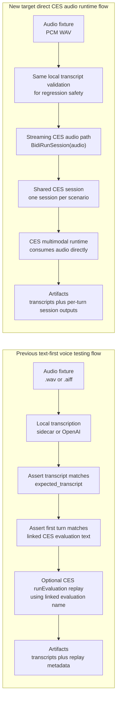

# Voice Testing Flow Comparison

This note compares the **previous text-first voice-testing path** with the
**new target direct CES audio runtime path**.

## Side-by-side flow

> **Live validation note (2026-03-29):** the first `--ces-session` prototype
> attempted single-turn `runSession` and CES returned
> `HTTP 400 ... Input audio config is not supported for RunSession.` The runner
> now uses **`BidiRunSession`**, which is the correct CES runtime audio path.

## Why this matters

The previous harness path is still useful because it protects the text
contract:

- audio fixture quality
- transcript stability
- alignment with linked CES evaluation text

The new target direct-session path adds a different assurance layer:

- the deployed CES runtime receives the real audio
- the scenario stays inside one CES session across multiple turns
- artifacts capture actual session outputs turn by turn

## Practical interpretation

- Use the **previous path** when you care most about regression safety and
  transcript drift.
- Use the **new target path** when you need confidence that the CES multimodal
  runtime itself can process the prerecorded audio fixtures through
  `BidiRunSession`.