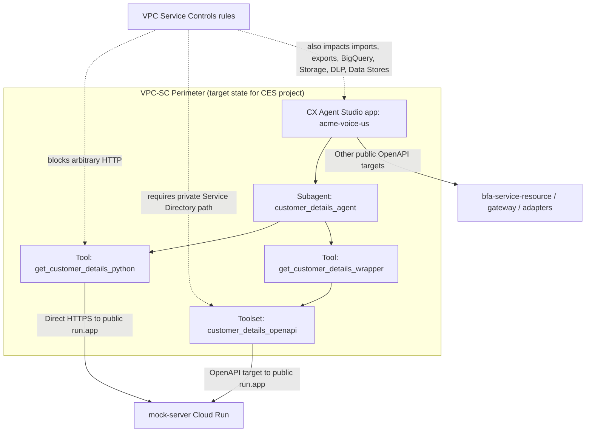

# VPC Service Controls Problem Statement for CES Banking Agent

Author: Codex
Date: 2026-03-28
Status: Design problem statement
Verified against official documentation on 2026-03-28

## Purpose

This document defines the problem we need to solve if the current `ces-agent`
application is deployed in a VPC Service Controls environment.

It is written to answer four practical questions:

1. What breaks in the current CES architecture when VPC Service Controls is enabled?
2. How do we reproduce that condition safely and observe the impact?
3. Which solution options are realistic for this repository?
4. What work is required to move from the current public Cloud Run topology to a
   perimeter-compatible architecture?

## Scope

This problem statement is focused on the current CES application and its backend
connectivity patterns:

- app: `acme-voice-us`
- direct Python tool: `get_customer_details_python`
- Python wrapper tool: `get_customer_details_wrapper`
- OpenAPI toolset: `customer_details_openapi`
- public backend targets currently declared in
  `acme_voice_agent/environment.json`

The current customer-details comparison is intentional:

- `get_customer_details_python`
  pure Python direct HTTP implementation
- `get_customer_details_wrapper`
  Python orchestration layer over `customer_details_openapi`
- `customer_details_openapi`
  OpenAPI contract for the same three-step token flow

This gives us a controlled way to compare what VPC Service Controls does to:

- direct Python HTTP from CES
- OpenAPI-backed service calls from CES
- thin-wrapper orchestration over OpenAPI

## Problem Statement

The current `ces-agent` package assumes that CES can reach backend services
through public Cloud Run URLs such as `*.run.app`.

That assumption conflicts with the official CX Agent Studio VPC Service Controls
documentation in a critical way:

- tools and callbacks cannot send requests to arbitrary HTTP endpoints when
  VPC Service Controls is enabled
- private backend access must be configured through Service Directory private
  network access

This means the current architecture is at risk if a perimeter is introduced.

The highest-risk path is:

- `get_customer_details_python`

because it performs direct backend HTTP calls from Python.

The lower-risk but still incomplete path is:

- `get_customer_details_wrapper` -> `customer_details_openapi`

because the wrapper itself survives only if the OpenAPI toolset is migrated
from public URL access to Service Directory private network access.

## Why This Matters

For a banking agentic application, VPC Service Controls is not just a network
choice. It changes which integration patterns remain valid in production.

If we do not address this explicitly, we risk all of the following:

- tool failures only after perimeter enforcement
- misleading success in non-perimeter development environments
- broken Cloud Storage import/export flows
- broken BigQuery conversation export flows
- failures caused by secrets, data stores, or redaction templates living
  outside the perimeter

## Official Baseline

The official Google documentation establishes the following constraints:

- VPC Service Controls protects CX Agent Studio app data and `runSession`
  requests and responses.
- related services such as BigQuery, Cloud Storage, DLP templates, and Data
  Stores must be available under the same perimeter when used by the app.
- tools and callbacks cannot send requests to arbitrary HTTP endpoints when
  VPC Service Controls is enabled.
- CX Agent Studio supports Service Directory private network access for OpenAPI
  tool targets inside a VPC network.
- OpenAPI authentication keys cannot reference secrets outside the perimeter.
- service perimeters should be created in dry-run first when impact is not yet
  fully known.
- perimeter changes can take up to 30 minutes to propagate and may temporarily
  cause `403` policy denials.
- ingress and egress rules must be explicitly designed if traffic crosses the
  perimeter boundary.

## Current Architecture Under VPC-SC



## Current Repository Evidence

These local files define the current topology:

- `acme_voice_agent/environment.json`
- `acme_voice_agent/tools/get_customer_details_python/python_function/python_code.py`
- `acme_voice_agent/tools/get_customer_details/python_function/python_code.py`
- `acme_voice_agent/toolsets/customer_details/open_api_toolset/open_api_schema.yaml`

These local suites already give us a reproducible baseline:

- `test-harness/smoke/suites/ces/customer-details-smoke-suite.json`
- `test-harness/smoke/suites/ces/customer-details-header-capture-smoke-suite.json`

Today, outside a perimeter, both CES tool variants are healthy:

- `get_customer_details_python`
- `get_customer_details_wrapper`

That is the correct baseline for a VPC-SC experiment.

## Hypotheses To Validate

### H1

`get_customer_details_python` will fail in a VPC-SC environment because it
depends on direct HTTP from a CES Python tool to a public backend endpoint.

### H2

`get_customer_details_wrapper` will also fail if `customer_details_openapi`
continues to target a public `run.app` URL instead of Service Directory private
network access.

### H3

`get_customer_details_wrapper` can remain viable inside a perimeter if the
OpenAPI toolset is migrated to Service Directory private network access and all
required secrets and supporting services are inside the perimeter.

### H4

Perimeter rollout can also break non-tool flows such as:

- app import/export via Cloud Storage
- conversation export to BigQuery
- DLP redaction
- datastore-backed tools

even if the customer-details backend path is fixed.

## Reproduction Plan

The safest reproduction path is to use a dry-run perimeter first.

### Phase 1: Establish a clean non-perimeter baseline

Run the existing CES smoke suites:

```bash
cd /Users/constantinaldea/IdeaProjects/ai-account-balance/ces-agent/test-harness/smoke
python3 ces-runtime-smoke.py run-suite \
  --suite /Users/constantinaldea/IdeaProjects/ai-account-balance/ces-agent/test-harness/smoke/suites/ces/customer-details-smoke-suite.json

python3 ces-runtime-smoke.py run-suite \
  --suite /Users/constantinaldea/IdeaProjects/ai-account-balance/ces-agent/test-harness/smoke/suites/ces/customer-details-header-capture-smoke-suite.json
```

Expected baseline:

- pure Python tool passes
- wrapper tool passes
- OpenAPI method passes

### Phase 2: Create a dry-run service perimeter

Create a new perimeter in dry-run mode and include:

- the CES project
- any project hosting related protected resources

At minimum, protect:

- `ces.googleapis.com`
- `contactcenterinsights.googleapis.com`

Add additional restricted services if they are part of the app runtime:

- `storage.googleapis.com`
- `bigquery.googleapis.com`
- Secret Manager, if used
- Discovery Engine / data store related services, if used

Do not change the current backend topology yet. Keep the public `run.app` URLs.
This is important because it reproduces the exact current architecture under
VPC-SC pressure.

### Phase 3: Observe dry-run impact

Use dry-run logging and violation reporting to observe which paths would be
denied without yet breaking the environment.

Focus first on:

- CES tool execution
- OpenAPI toolset execution
- any Cloud Storage import/export calls
- any BigQuery export paths

### Phase 4: Enforce and rerun the same tests

After dry-run evidence is understood, enforce the perimeter and rerun:

1. `list-resources`
2. `get_customer_details_python`
3. `get_customer_details_wrapper`
4. `customer_details_openapi::getEidpToken`
5. optional `runSession` conversation test

## Minimal Reproduction Matrix

| Scenario | Current backend shape | Expected outcome |
|---|---|---|
| A | No perimeter, public `run.app` URLs | All current customer-details tests pass |
| B | Dry-run perimeter, public `run.app` URLs | Violations should identify direct Python HTTP and public OpenAPI target risk |
| C | Enforced perimeter, public `run.app` URLs | Pure Python should be treated as likely failing; wrapper path is also at risk |
| D | Enforced perimeter, OpenAPI migrated to Service Directory private access | Wrapper path becomes the primary candidate to keep |
| E | Enforced perimeter, pure Python still calling direct HTTP | High-risk / likely invalid production pattern |

## Solution Options To Evaluate

### Option 1: Keep the current public Cloud Run topology

What changes:

- none

Assessment:

- useful only as a non-perimeter baseline
- not a serious VPC-SC target architecture

Recommendation:

- reject for perimetered production use

### Option 2: Keep pure Python direct HTTP under VPC-SC

What changes:

- try to preserve `get_customer_details_python` as-is

Assessment:

- conflicts with the official CES VPC-SC limitation on arbitrary HTTP from
  tools and callbacks
- useful only as an experiment to prove the failure mode

Recommendation:

- keep only as a controlled comparison path
- do not treat as the target production pattern

### Option 3: Migrate OpenAPI toolsets to Service Directory private network access

What changes:

- move backend exposure away from public `run.app` targeting
- configure Service Directory private network access
- grant CES service agent the documented Service Directory roles

Assessment:

- best fit with the official CES VPC-SC design
- preserves schema-driven backend contracts
- preserves the wrapper pattern for deterministic orchestration

Recommendation:

- recommended primary solution

### Option 4: Keep the wrapper and retire direct Python backend calls in production

What changes:

- preserve `get_customer_details_wrapper`
- keep `get_customer_details_python` only for dev/test comparison or remove it
  from production-facing agents

Assessment:

- aligns with the likely production-safe pattern under VPC-SC
- still allows direct comparison in non-perimeter environments

Recommendation:

- recommended with Option 3

## Required Work

### Workstream 1: Perimeter design

We need to identify:

- which projects belong inside the perimeter
- which Google services must be protected
- which supporting resources currently live outside the perimeter
- which ingress and egress rules are actually required

### Workstream 2: Backend connectivity redesign

We need to:

- move customer-details backend connectivity to Service Directory private access
- evaluate whether `mock-server`, `bfa-service-resource`, `bfa_gateway`, and
  `branch_finder_adapter` need the same treatment
- update toolset configuration accordingly

### Workstream 3: CES service-agent access

We need to ensure the CES service agent exists and has the documented roles in
the Service Directory project:

- `servicedirectory.viewer`
- `servicedirectory.pscAuthorizedService`

### Workstream 4: Validation

We need to re-run:

- CES smoke suites
- direct `execute_tool` and `execute_toolset` checks
- optional simulator conversation flows
- import/export checks if Cloud Storage is in scope
- BigQuery or datastore checks if those features are in scope

## Decision Framework

The decision should be made with this rule:

- if the goal is perimeter-compatible production architecture, optimize for
  `wrapper + OpenAPI + Service Directory`
- if the goal is only to understand CES runtime behavior, preserve
  `get_customer_details_python` as a comparison tool, but do not mistake that
  for the likely production answer

## Recommended Next Step

The immediate next step should be:

1. create a dry-run perimeter
2. leave the current public backend URLs unchanged
3. rerun the existing customer-details suites
4. record which exact paths violate the perimeter
5. then design the Service Directory migration based on observed evidence

This gives us a controlled before/after comparison rather than jumping straight
to a network redesign without proof.

## References

Official documentation:

- [Configure VPC Service Controls for CX Agent Studio](https://docs.cloud.google.com/customer-engagement-ai/conversational-agents/ps/vpc-service-controls)
- [Create a service perimeter](https://docs.cloud.google.com/vpc-service-controls/docs/create-service-perimeters)
- [Dry run mode for service perimeters](https://docs.cloud.google.com/vpc-service-controls/docs/dry-run-mode)
- [Ingress and egress rules](https://docs.cloud.google.com/vpc-service-controls/docs/ingress-egress-rules)

Local repository references:

- `acme_voice_agent/environment.json`
- `acme_voice_agent/tools/get_customer_details_python/python_function/python_code.py`
- `acme_voice_agent/tools/get_customer_details/python_function/python_code.py`
- `acme_voice_agent/toolsets/customer_details/open_api_toolset/open_api_schema.yaml`
- `smoke-tests/suites/ces/customer-details-smoke-suite.json`
- `smoke-tests/suites/ces/customer-details-header-capture-smoke-suite.json`
